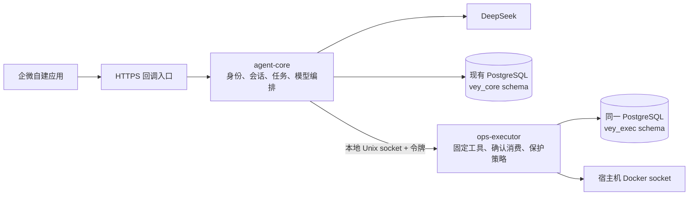

# Vey

通过企业微信自建应用管理个人 Ubuntu 服务器的运维 Agent。面向 AI 应用／Agent 开发实践，按三期建设：可靠运维闭环 → 诊断评测 → 管理后台。

**第一期核心及代表性企微聊天链路已验收，日志摘要／展开、资源排行和中文结果展示已补齐，正在进行最终部署验收。** 详见[服务器验收记录](docs/server-acceptance.md)、[模型验收记录](docs/model-acceptance.md)、[聊天链路验收](docs/phase1-chat-acceptance.md)与[开发进度](docs/development-plan.md)。

## 能做什么

- 服务器信息、配置范围内的 Compose 服务状态、资源和业务健康检查。
- 服务器概况以中文摘要展示采样时间、CPU、内存、运行时长、已配置磁盘及前五项进程常驻内存；缺失指标明确提示，不据此断言业务正常。
- 日志默认最近 100 行，无默认时间筛选；每页最多 500 行／10000 Unicode 字符，支持关键词、时间范围、截断提示和向前翻页。
- 默认日志回复为关键词统计及关键原文，明确不等同于故障结论；「展开日志」返回同一页脱敏快照，不消耗下一页游标。
- 容器资源按内存或 CPU 排行，限定已登记服务和受保护容器；系统阈值可配置，按需查询时提示，不主动告警。
- 故障排查最多 5 次只读工具调用、60 秒；到达上限后返回已有证据，不自动续查。
- 对已有容器启动、停止、重启；8 位确认码 2 分钟有效，仅消费一次，保护清单在执行器内强制生效。
- 会话 15 分钟无用户消息失效；支持清空、任务查询；常规审计保留 30 天。

没有任意 Shell、容器内 exec、部署、删除、拉取镜像或修改配置接口。Jev 预留 `IntentRouter` 接口，第一期没有 Jev 运行依赖。

## 架构



Python 3.13、FastAPI、Pydantic 2、HTTPX、SQLAlchemy／psycopg、Alembic、Docker SDK，依赖锁定在 `uv.lock`。单实例核心服务使用 PostgreSQL 任务表和 outbox，不引入 Redis／Celery。

核心进程没有 Docker socket，两个组件使用独立数据库角色。执行器虽然以非 root UID 运行，但 **Docker socket 权限仍接近宿主机 root 权限**；分离进程和工具白名单不能消除执行器自身被攻破的风险，也不能在核心服务完全失陷时独立证明人类确认。

## 开发与测试

```bash
uv sync --frozen
uv run ruff check .
uv run ruff format --check .
uv run pytest -q
```

没有测试数据库时，PostgreSQL 集成用例会明确跳过。完整测试须设置 `VEY_TEST_DATABASE_URL=postgresql+psycopg://.../vey_test`，连接**专用测试实例／数据库**。测试会重建该库内的 Vey schema；数据库名必须以 `vey_test` 开头，权限测试需要可创建角色的测试管理员。不能用生产库跑测试。

测试涵盖真实 PostgreSQL 迁移、事务、并发确认、去重、权限隔离和生命周期；Docker 和模型行为使用替身，企微使用本地加密消息测试。测试通过不等于外部服务已联调通过。完整测试管理员还需具备建库权限，用于在临时 `vey_test_upgrade_*` 数据库验证旧版本升级，结束后自动清理。

## 部署和使用

按[Ubuntu 部署手册](docs/deployment.md)连接现有 PostgreSQL 容器、初始化专用库和账号、配置保护对象及密钥，再启动独立 Compose 项目。生产 Compose **不包含 PostgreSQL 服务**。

企微示例：

```text
服务器概况
服务列表
资源排行
CPU排行
状态 博客
日志 博客
展开日志
下一页
帮我排查博客为什么访问不了
重启 博客
确认 12AB34CD
清空上下文
任务 <32位任务编号>
操作 <32位原操作任务编号>
```

固定指令无需模型；其他自然语言调用 DeepSeek。确认和清空完全由确定性代码处理。模型默认配置见 `.env.example`，当前使用 `deepseek-flash`，上线时以账号可用模型和[DeepSeek 官方接口文档](https://api-docs.deepseek.com/api/create-chat-completion/)核对；模型名可配置，其他厂商协议需要单独适配。

## 数据与恢复边界

| 数据 | 实现位置 | 保留方式 |
| --- | --- | --- |
| 当前上下文 | `vey_core.sessions` | 15 分钟无用户消息失效；后台清理最长约 30 秒，读取立即拒绝过期上下文 |
| 任务、事件摘要 | `vey_core.tasks/events` | 常规记录 30 天；任务结果最多保留 3000 字符用于审计查询 |
| 接收提示、结果投递 | `vey_core.outbox` | 成功投递后按创建时间 15 分钟清空正文；未投递正文最多保留 1 小时，之后停止投递 |
| 确认及执行事实 | `vey_exec.grants` | 常规记录 30 天；未核对的 unknown/executing 留存，避免删除后解除安全锁 |
| 日志分页快照 | `vey_exec.log_cursors` | 脱敏后保存；最长到当前会话期限，每个用户最多 10 个游标 |

日志读取内部有 5000 行／1 MB 扫描窗口；窗口内可翻页，更早内容需要明确时间范围。容量超限会提示缩小范围，不会假装完整读过全部历史。本页展开快照最多 10000 字符，暂存会话至快照到期或会话清空；原文不会随意图分类请求发送给模型，展开任务只保存摘要审计。

Docker 修改与数据库提交不能组成原子事务。调用前持久化 `executing`，超时或重启后保守标记 `unknown`，不自动重放。同一服务在结果未知时拒绝后续修改；管理员可按部署手册核对并记录解除锁定，不能把状态查询当成历史操作成功的证明。

长回复按 UTF-8 分段并记录已确认投递的段数；发送失败从未确认段继续，每段最多尝试 10 次，投递总期限为创建后 1 小时。消息重试不会重跑 Docker。企微接收成功但本地进度尚未提交时仍有重复窗口，不能承诺端到端恰好一次投递。核心服务重启会为正在执行的企微任务保留一次中断通知，不自动重放任务。

更多：[需求](docs/requirements.md) · [技术方案](docs/technical-design.md) · [三期路线和数据设计](docs/roadmap-and-data.md) · [开发进度与待验收项](docs/development-plan.md) · [聊天链路验收](docs/phase1-chat-acceptance.md) · [演示流程](docs/demo.md)
