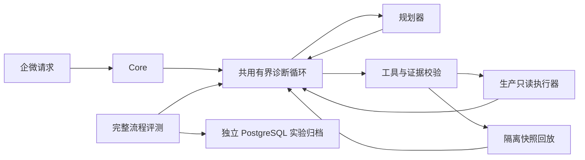

# 历史验收证据

这里集中保存各阶段的原始验收叙述，供追溯，不作为当前操作手册。**每节的镜像、测试数、待办和“尚未接入”等说法仅代表该节日期。** 当前状态以 [V1 验收清单](../v1-delivery.md) 为准；日常阅读从 [文档导航](../README.md) 开始。原始评测文件仍在 [evals/reports](../../evals/reports)。

- [Docker 与 PostgreSQL 服务器验收记录](#server-acceptance)
- [DeepSeek 真实只读流程验收](#model-acceptance)
- [企微消息链路与 HTTPS 准备验收](#wecom-readiness)
- [第一期聊天链路验收记录](#phase1-chat-acceptance)
- [第二期 M1：真实模型基线与失败复核](#phase2-baseline)
- [第二期 M2：结构化诊断与完整流程回放](#phase2-diagnosis)
- [第二期 M3 发布与路由对照](#phase2-release)
- [诊断语义与明确检查项补全](#diagnosis-followthrough)
- [第三期 M1 管理后台验收](#dashboard-acceptance)
- [第三期 M2 上线与验证记录](#dashboard-evidence-acceptance)
- [M3 本机备份与恢复验收](#operations-recovery-acceptance)
- [第三期配置管理验收](#configuration-acceptance)

<a id="server-acceptance"></a>
## Docker 与 PostgreSQL 服务器验收记录


日期：2026-09-26。本记录覆盖用户授权的服务器部署及 Docker／数据库验收。当时 DeepSeek 凭据尚未配置；随后完成的真实模型只读验收另见[模型验收记录](history.md#model-acceptance)。企微端到端尚未验收。

### 环境与部署

| 项目 | 实际环境 |
| --- | --- |
| 系统 | Ubuntu 22.04.5 LTS，x86_64，约 4 GB 内存 |
| Docker / Compose | Engine 29.7.2 / Compose v5.5.0 |
| 数据库 | 已有容器中的 PostgreSQL 16.15；新增专用 `vey` 数据库 |
| 应用运行时 | Python 3.13.15，镜像 `vey-agent:0.1.0` |
| 安装目录 | `/opt/vey` |
| 运行角色 | `vey_core` 仅访问核心 schema；`vey_executor` 仅访问执行 schema；单独的迁移所有者 |
| 网络 | 新增私有网络 `vey-db`，将原 PG 容器附加到该网络；未重启 PG，保留其原网络与默认路由优先级 |
| 核心入口 | 仅绑定 `127.0.0.1:8080`；执行器仅通过 Unix socket 通信 |

现有数据库、缓存、对象存储和入口容器没有 Compose 标签，因此以完整容器 ID 登记保护，并配置不可修改的逻辑别名。本轮只操作独立 `vey-acceptance/web` 测试服务。此处不公开实际公网地址、业务容器 ID 或凭据。

### 验收结果

| 项目 | 结果与证据 |
| --- | --- |
| 镜像构建与服务就绪 | 通过；两个组件均健康，核心等待执行器健康后启动 |
| 非 root 与 Docker 权限分离 | 通过；核心 UID 10001，无 Docker socket；执行器 UID 10002，附加宿主机 Docker GID |
| 文件和入口权限 | 通过；容器根文件系统只读，配置／密钥只读挂载，共享 socket 目录为 `0770`，执行器无发布端口 |
| 数据库角色隔离 | 两个真实运行账号均可访问自己的 schema，跨 schema 查询和公共 schema 建表均被 PG 拒绝 |
| 身份验证 | 未认证调试访问返回 401，非本人 UserID 返回 403 |
| 宿主机查询 | 已读取实际 CPU、内存、已映射文件系统容量及采样时间；不是容器指标替代宿主机数据 |
| Compose 服务与资源 | 通过；正确解析独立测试服务并读取真实容器状态、内存等信息 |
| 受保护服务 | 6 个保护条目 × 启动／停止／重启，共 18 次请求全部拒绝 |
| 日志 | 实际生成 240 条测试日志；默认 100 行、脱敏、分页不重复、10000 字符截断与游标均通过 |
| 禁止工具 | 任意 Shell 工具请求返回 422，未开放执行命令接口 |
| 启停重启与确认 | 真实测试容器停止、启动、重启成功；重复消息去重；重复确认返回同一执行事实，容器启动／停止时间不变 |
| 清空上下文 | 通过；清空后旧确认不能使用 |
| 模型未配置 | 自然语言分析明确失败，不伪造分析结论或执行修改 |
| Agent 重启 | 服务恢复健康，已完成的容器操作未重放，运行角色权限仍有效 |
| 备份恢复 | 专用库导出为 30722 字节备份，恢复到随机新建临时库；7 张表的行数和内容哈希、迁移版本 0001 一致；随后删除临时恢复库 |
| 既有业务影响 | 原有四个业务容器保持 running，启动时间与验收前一致 |

可复现脚本：`scripts/acceptance_smoke.py`、`tests/fixtures/acceptance.compose.yaml` 和 `scripts/backup_restore_drill_docker.py`。首次本地数据库回归为 40 项，本轮新增两项 Docker 适配边界测试后，最终 **42 passed**，Ruff 检查与格式检查通过。

### 本轮修复

1. Docker SDK 将 datetime 日志截止时间截到整秒。原先默认传入“现在”可能漏掉同一秒刚写入的日志；现在仅在用户明确提供截止时间时传入 `until`，默认依靠 `follow=False` 的有限快照和缓存分页。
2. 构建环境访问原始 Python 包地址失败。增加 `PYTHON_PACKAGE_INDEX` 构建参数，从冻结锁文件导出带哈希的精确依赖清单，再按指定索引下载和验证；默认仍使用 PyPI。
3. 补充执行器健康检查、核心对执行器的就绪依赖，以及验收脚本的有界就绪等待，避免启动瞬间连接失败。
4. 只读容器拒绝 `docker cp` 写入，因此验收脚本通过 `docker compose exec -T ... python -` 从标准输入运行，没有放宽文件系统权限。

### 收尾状态和边界

- `/opt/vey` 下核心服务和执行器保持健康运行。后续已配置 DeepSeek 并通过只读流程验收，企微凭据尚未配置。
- 专用测试容器已删除；其固定测试服务条目仍在配置中，查询会明确显示未部署，不会自动创建容器。
- `VEY_DEBUG_ENABLED=false`，已验证调试路径返回 404。
- 配置中的本人身份暂为本地验收标识；接企微前必须替换为本人实际 UserID。
- 密钥和数据库密码仅保存于服务器本地受限文件，未提交 Git。迁移账号不注入常驻应用。
- 备份保存在 `/opt/vey/.local/backups`，本轮验证了数据恢复和迁移版本；这是同机备份，尚未覆盖整机损坏。异机备份、恢复后角色授权和旧任务作废仍须纳入正式灾难恢复流程。
- 本轮日志验证针对单实例测试服务；多实例边界和日志轮转仍待补充验收。完整磁盘映射、排行与异常阈值、手机端展示等剩余项见开发计划。

**Docker／数据库核心验收已通过，不代表第一期所有需求或企微聊天闭环已经完成。**

<a id="model-acceptance"></a>
## DeepSeek 真实只读流程验收


日期：2026-09-26。用户在服务器本地配置 Key 后，验收已运行的核心服务、真实 DeepSeek API、独立执行器和 PostgreSQL 审计记录之间的流程。

### 接入与场景

- 提供方地址：`https://api.deepseek.com`。
- `/models` 鉴权返回 HTTP 200，确认账号可用模型包含当前配置的 `deepseek-flash`。
- 提示词版本 `v2`，使用 JSON 输出与 Pydantic 参数校验。
- 通过 `scripts/model_smoke.py` 提交到已有任务队列，由正在运行的核心 worker 处理；整个过程中 HTTP 调试入口保持关闭。

| 场景 | 实际行为 | 结果 |
| --- | --- | --- |
| 自然语言询问服务器 CPU 与内存 | 模型分类为 query，调用宿主机 `system` 工具 | 成功；1 次模型请求，API 返回总用量 1104 tokens |
| 排查运维助手运行情况 | 模型分类为 diagnose，依次调用 `inspect`、`logs`、`health`，随后总结 | 成功；3 次只读工具调用、5 次模型请求，任务耗时约 6.03 秒，API 返回总用量合计 7306 tokens |

诊断结论正确区分容器与业务状态：容器 running 且 Docker health 为 healthy，近期日志为正常启动记录，但工具没有配置业务健康 URL，因此不能确认业务功能已正常或已修复。总结引用 E1/E2/E3，并说明未采集资源等未知事项。没有生成修改操作确认，也没有执行启动、停止或重启。

上述用量和耗时来自这两条成功样本，不含此前故障定位请求；不是长期延迟基准、成功率评测或费用账单。缓存用量与请求元数据已保存于审计事件中，不保存模型内部思维链。

### 发现的问题与修复

首次真实资源查询被模型错误输出为 `stats` 且缺少 target。参数校验按预期拒绝，未调用工具。提示词 v1 与 schema 没有充分说明 `system` 表示宿主机资源、`stats` 表示指定容器资源。

修复为：在工具 schema 描述及路由／排查提示中明确各工具用途、目标必填规则，并加入宿主机资源查询示例，提示版本更新为 v2。没有放宽参数校验，也没有自动猜测容器目标。新增回归测试确保无目标的 stats 输出仍会被拒绝。

修复后两条真实流程通过，本地完整测试为 **43 passed**，Ruff 与格式检查通过。测试结束时清空测试会话，操作审计继续保留；核心及执行器保持健康。

### 尚未覆盖

此验收不包含真实企微消息、模型生成操作意图后的完整人类确认流程、大规模提示注入评测或多模型比较。企微接入及第一期其余功能仍按开发计划推进，不能凭两个成功样本宣称模型全面可靠。

<a id="wecom-readiness"></a>
## 企微消息链路与 HTTPS 准备验收


更新：2026-09-30。只记录实际验证结果，不把回调验证视为真实企微聊天验收。具体域名、企业／成员 ID、密钥和证书私钥只保存在部署环境，未写入本仓库。

### 2026-09-30 公网接入进展

用户确认备案通过后，恢复 HTTPS 网关。ACME 测试环境域名校验及签发成功，随后切换正式 CA，正式证书已签发，有效期至 2026-12-29 09:36:20 UTC。服务器使用默认信任链访问公网域名，带签名 GET 回调返回正确挑战明文，错误签名返回 403，debug/health/openapi 路径均返回 404。本地电脑通过 HTTPS 再次检查，未带参数的回调返回预期 422，调试路径返回 404，全程未跳过正式证书校验。

网关现已运行，证书由 Caddy 管理续期；尚未经历一次实际到期续签。Token／EncodingAESKey 保持原值，未发送企微消息。剩余：用户在企微后台保存回调、核对可信 IP，并从本人手机完成查询与确认操作验收。以下 9 月 28 日的连接重置及停止入口记录是历史状态。

随后用户成功保存企微回调并发送「服务器概况」。任务成功执行，最初回复受企微可信 IP 限制；只读应用接口返回 60020，已提示用户补充服务器出口 IP。用户随后确认收到该任务的 JSON 查询结果，首次真实查询收发闭环通过，采样时间为北京时间 2026-09-30 18:39:48。

为改善阅读体验，系统查询现使用确定性中文模板，保留北京时间采样时间，将字节换算为 GiB／MiB、运行秒数换算为天／小时／分钟，展示前五项进程常驻内存。磁盘只展示已配置采集范围的可用量与总量，缺失指标不显示为零，不调用模型做格式化。完整回归更新为 56 passed，Ruff 检查与格式检查通过。其他工具结果暂保持原格式；企微启停重启及诊断等场景仍需逐项验收。

### 消息可靠性改进

- `outbox.sent_parts` 记录已收到成功响应且写入数据库的段数，迁移版本为 `0002`。
- 脱敏正文按最多 1700 UTF-8 字节切分；多段时添加稳定的任务编号和段号，最终消息小于 1800 字节。相同内容的不同段具有不同标题，避免被发送接口的重复检查误认为同一段。
- 每轮领取只发送一段，确认后推进进度；失败只重试当前段，每段最多 10 次，退避上限 300 秒，整条结果创建后 1 小时停止发送。
- 已领取但进程中断的投递等待 60 秒租约到期后恢复。最后一次尝试中断时标记失败，不会无限停在 sending。
- 清理线程已将过期消息标记失败时，迟到的发送响应不能把它恢复成待发或成功。
- 核心重启将 running 任务标记 unknown，并为企微任务在同一事务内补一条结果通知。重复启动不会重复生成通知，不重跑原任务。

消息接口与本地 PostgreSQL 不在一个事务内。如果企微已接收、但网络响应或进度提交丢失，同一段仍可能重复；接口重复检查只能减少该窗口，不能提供端到端恰好一次保证。本版仍要求单实例 worker。

### 已完成验证

| 场景 | 结果与证据 |
| --- | --- |
| 本地完整测试 | 54 passed，无跳过；Ruff 检查和格式检查通过 |
| 长回复第二段失败 | 重新实例化 Core 后从第二段恢复，第一段不重发，后续各段按原边界投递 |
| 重试与租约 | 10 次耗尽后失败、最后一次中断不会超限、未过租约不重发 |
| 清理竞态 | 过期消息不发送；已过期消息的迟到 ACK 不恢复状态 |
| 重复消息 | 任务完成后的重复 MsgId 不增加任务或回复；已有 HTTP 回调身份／验签／去重测试继续通过 |
| 重启任务 | running → unknown，生成一次中断通知，无 Docker 重放 |
| 令牌失效 | 模拟接口 40014／42001 后，下一次投递重新获取访问令牌 |
| 旧数据迁移 | 临时真实 PostgreSQL 从 0001 升至 0002，原正文、状态和尝试次数不变，sent_parts 初始化为 0 |
| 服务器升级前备份 | 停止 Vey 写入后备份并恢复到临时库，七张表数量及内容摘要一致，迁移 0001 一致；临时库已清理 |
| 服务器升级 | 迁移至 0002，核心和执行器健康，核心运行角色能读取新增列 |
| 真实企微鉴权（2026-09-27） | 获取访问令牌成功；不输出令牌或密钥 |
| 私网 HTTPS 代理 | 使用临时内部测试 CA，无公网端口；正确回调返回挑战明文、错误签名 403、超大请求 413、非 GET/POST 回调及 debug/health/openapi 路径 404 |

私网测试完成后已删除临时代理容器。未向企微用户发送测试消息，未产生额外模型调用。原有 Nginx、PostgreSQL、Redis、MinIO 的容器启动时间保持不变。

### HTTPS 当前状态

新增可选 `compose.https.yaml`、`deploy/Caddyfile` 和最小网关镜像：

- Caddy 2.11.4 基础镜像以 digest 固定，移除低端口绑定文件能力，使用 UID 10003、只读根目录、cap_drop=ALL。
- 宿主机 443 转发至容器 8443；通过 TLS-ALPN-01 校验域名，不占用原 Nginx 的 80。
- 只代理 `/wecom/callback` 的 GET/POST，限制正文 64 KB，管理 API 关闭，私有健康检查不发布端口。
- 网关只有独立 ingress 网络，不加入数据库网络；不挂载 Docker socket 或企微密钥。
- 证书保存在受限宿主机目录，已列入 Git 忽略；进程常驻时由 Caddy 管理续期，尚未实际验证一次到期续签。

ACME **测试环境**已尝试域名校验：有校验请求到达容器，但整体返回 `Connection reset by peer`，本地外网探测也收到连接重置。无法仅凭此认定是备案拦截还是网络策略；**没有签发正式证书**。为停止反复申请，公网网关已停止，并设为显式 `https` profile；核心和执行器继续运行。

### 备案通过后的验收清单

1. 核对域名解析、云安全组 443、宿主机网络规则与企微域名校验要求。
2. 按部署手册显式启用 https profile，在 ACME 测试环境完成签发，再切换正式 CA；使用标准信任链验证，不能用跳过证书校验代替。
3. 核对证书域名、到期时间、外网回调验证，以及 debug/health/openapi 均未对外开放。
4. 在企微后台保存既有 Token／EncodingAESKey 和 HTTPS URL，完成平台校验及可信 IP 配置。
5. 从本人手机发送系统查询、日志翻页、有限诊断，验证长结果分段和会话清空。
6. 使用独立测试容器验收启停重启与确认过期；受保护对象应直接拒绝。完成后移除测试容器。

<a id="phase1-chat-acceptance"></a>
## 第一期聊天链路验收记录


初次验收：2026-09-30；2026-10-01 完成过期状态复核与清理。2026-10-03～04 完成新增功能回归、完整静默过期测试及最终部署核对，见本文补充记录。环境：已部署的 Ubuntu、Docker、PostgreSQL 16、DeepSeek 与企业微信自建应用。

### 验收口径

用户已从企微客户端发送「服务器概况」并确认收到回复。本轮代表性场景由验收脚本生成符合协议的加密消息，发送至真实公网 HTTPS 回调，走运行中的核心 worker、执行器和实际企微发送接口。入站消息为模拟回调，不冒充用户手动输入；投递成功表示企微接口已接收，不单凭这一点认定手机已阅读。

启停只作用于独立项目 `vey-acceptance/web`。其他项目只执行保护拒绝测试。测试占用并清理配置用户的会话，不修改生产会话时间来缩短等待。HTTP 调试入口始终关闭。

### 已通过的场景

| 场景 | 实际证据 |
| --- | --- |
| 真实公网加密回调 | 合法加密请求返回空 200，进入正式持久化任务队列；重复 MsgId 未增加任务及回复 |
| 默认日志与翻页 | 两页各 100 条测试日志，内容不重叠；虚拟 password 值被脱敏；第一页实际分 4 段发送 |
| 日志双上限 | 请求 500 行时在 10000 字符处截断（本次为 150 行），提供游标；501 行参数被 422 拒绝 |
| 工具范围 | shell 请求被 422 拒绝 |
| 保护清单 | 6 个受保护服务的启动／停止／重启，共 18 个请求全部拒绝 |
| 启停与确认重启 | 真实临时容器停止、启动、重启后状态符合预期；重启改变 StartedAt；重复确认不再次改变启动时间 |
| 取消 | 取消后再确认返回 cancelled，容器时间戳不变 |
| 两分钟确认过期 | 不调整时钟，实际等待 125 秒后确认被拒绝或返回 expired，容器时间戳不变 |
| 清空上下文 | 待确认操作不能继续确认；旧日志游标返回 409 |
| 真实模型排查 | 调用 3 个只读工具，返回带 E1 等证据编号的结论；无 operation_prepared／operation 事件 |
| 核心重启恢复 | 核心停止后注入一个已领取的只读测试任务；实际启动后标记 unknown 并发送恢复通知，无工具执行事件，容器启动时间不变 |
| 日志轮转 | 测试容器采用 1 MB／1 文件轮转，写入约 1.8 MB 合成日志；缓存的旧分页仍与轮转前快照完全一致；新查询能读取最后一条保留日志 |
| 多实例与同名隔离 | 临时扩为 2 个实例，各生成 20 条日志；合并 40 行按时间排序并带容器标识；另建同名服务的其他项目容器未被发现为目标 |

回调场景及恢复通知合计 12 条 outbox 记录，全部 sent，共 19 个实际投递分段。模型排查调用 5 次 API（意图 1 次、规划／总结 4 次），本次用量总计 13132 tokens；这些是单次验收观测，不能作为通用速度或成本基准。

任务证据：确认重启 `0d170d96d5924caeb18701d56ee169d7`，诊断 `76d3c524cf7f40a581d1a9eacd7fda4e`，确认过期 `edcef8b7cd3d43398a9ae92a9ae53e47`，恢复通知 `9403fa3aebe64906ad580d1d66af68a5`。任务和摘要按现有 30 天策略保留，不把原始日志长期归档。

### 会话静默过期

测试任务 `820ac778ee9d45ebae985cb4c9f4c3d3` 于 9 月 30 日 19:10:54（北京时间）创建，会话期限为 19:25:54。等待过程中未修改时间戳。10 月 1 日 11:46:56 复核时，同一会话代次及期限保持不变，上下文为空、任务输入文本已清空、结果审计仍保留；核心拒绝旧任务（expired_session），执行器拒绝旧会话凭证（403）。当时没有排队／执行中的任务或待发送回复。

长时间测试进程已结束，但上一轮终端的最终输出未保留，不能据此确认后台清理发生在到期后的 40 秒内。因此本项记录为“真实过期后的状态及访问拒绝通过”，不声称精确清理时延已验收。复现时应将输出保存在服务器文件中。

10 月 1 日已删除全部临时测试容器，Vey 三个服务均健康；原有 Nginx、PostgreSQL、Redis、MinIO 的启动时间与测试前一致。

### 2026-10-03～04 收尾验收

本轮补齐日志摘要／同页展开、中文证据与操作结果、配置范围内的容器 CPU／内存排行、系统阈值和磁盘挂载范围提示。运行代码最终版本为 `7720a45`；本地完整回归 **65 passed，无跳过**，Ruff 检查、格式检查和 [GitHub Actions](https://github.com/xiao-xinm/vey/actions/runs/37178977611) 均通过。

#### 真实集成回归

10 月 3 日签名模拟回调继续走实际公网入口、执行器及企微发送 API。系统概况、资源排行、两页日志摘要与同页展开、确认重启、取消、真实等待 125 秒的确认过期、有限排查和清空撤销均通过。日志两页各 100 行且不重叠，第一页展开分 4 段，合成敏感值脱敏；6 个受保护服务的 18 个启停请求全部拒绝。仅独立测试容器发生启停。

本轮 9 个公网任务产生 18 条 outbox，全部 sent，共 25 个实际投递分段。模型诊断调用 3 个只读工具，没有操作事件；5 次模型 API 请求总计 12996 tokens，提示版本 v3。数量和用量仅代表本次验收。

关键任务：系统概况 `b95940012d3d4c5798c8659d4d4669c0`，资源排行 `c5c61e2d328247bb98682452544d53cc`，日志摘要 `8f8eaef0677a4750bf919ab2a1170fd2`，同页展开 `34dd1bc3d05344ec9a0fec27b30187e1`，确认重启 `943748a08a8e4dd694354960adcca9bd`，确认过期 `077ca753464a4cf2b5a777ff28e45961`，诊断 `104bdf38e26e46ec83b6aa0a7f3942e4`。服务器受限报告保存在 `/opt/vey/.local/phase1-20261003/chat-acceptance.log`，未将密钥或原始日志提交仓库。

#### 完整 15 分钟静默测试

测试使用包含快照清理修正的 `1b049e4` 版本，最终 `7720a45` 没有改变这部分逻辑。未调整时钟、会话期限或代次，真实等待完整 15 分钟；后台任务输出保存到 `/opt/vey/.local/phase1-20261003/session-idle-final.log`，10 月 4 日读取最终 `passed` 结果。

- 任务：`dcbb4fc404e7435d96c126bc70e4e263`。
- 会话到期：2026-10-03 13:03:44.717530（北京时间）。
- 观察到清理：2026-10-03 13:04:05.487341（北京时间）。
- 清理延迟观测上界：20.769827 秒，包含轮询间隔，不表示精确发生时刻。
- 上下文和任务输入已清空，任务结果审计仍保留；旧任务被核心拒绝为 `expired_session`，旧会话凭证被执行器拒绝为 403。

本记录补足了前一轮未保留最终输出、无法确定清理时延的证据缺口。另有回归测试验证：用户继续聊天使会话保持有效时，已到期的日志页仍会被单独清除。

#### 最终部署与客户端边界

10 月 4 日核心更新至 `7720a45`，执行器沿用代码未变化的 `1b049e4` 构建，网关保持原配置。三个服务健康；公网签名挑战响应、诊断日志提示修正、MinIO HTTPS 入口及调试／OpenAPI 路径不可公开访问均通过。服务器持久本地磁盘仅根挂载点 `/`，采集清单无遗漏；四个原有业务容器的启动时间与本轮验收前相同。

10 月 3 日已打开桌面企微核对实际中文诊断消息和脱敏后的分段回复。10 月 4 日解决本机磁盘空间问题后，用户本人完成企微要求的安全验证，随后助手按用户授权通过桌面客户端 UI 完成以下输入与显示核对。这是实际客户端发出的消息，不是合成回调；不将助手的界面操作描述为用户手动录屏或手机验收。

| 北京时间 | 客户端动作 | 结果及任务 |
| --- | --- | --- |
| 18:34:47 | 发送「服务器概况」 | 收到中文采样摘要、CPU／内存／磁盘／阈值提示；任务 `dbbe736a379845dab7f0a5c60ced97c5` |
| 18:35:33 | 发送「重启 测试服务」 | 展示目标、实例、两分钟确认码；任务 `98855e85f5c142a29a613672c4a14e5f`。确认前 Docker StartedAt 仍为 `2026-10-03T04:39:54.994171998Z` |
| 18:36:15 | 发送刚收到的确认指令 | 中文回复已完成、实例达到运行状态、业务健康检查通过；任务 `7342d01a735a4d7783dbbf5ff54c44c1`。Docker StartedAt 更新为 `2026-10-04T10:36:15.747972728Z` |

三个任务均为 succeeded，平台消息编号均为真实数字编号；6 条 outbox 均为 sent，共 6 个分段。客户端实际看到查询、确认提示和执行结果。报告保存于 `/opt/vey/.local/phase1-20261003/client-acceptance-final.json`。

验收后以内部控制入口执行测试会话清理，任务 `dcd5864e63214521af5739bbe142f757` 成功；旧输入、目标及确认上下文清除，当前历史仅保留清空指令自身的回执，原任务结果审计保留。随后使用明确的测试 Compose 文件删除 `vey-acceptance-web-1`，Vey 三个服务仍健康。**最后的真实客户端验收已完成，第一期交付完成。**

### 复现方式

先确认已配置 `vey-acceptance/web` 白名单且企微可向本人发送消息。测试会产生实际企微回复及少量模型费用，应在本人不操作聊天时运行：

```bash
cd /opt/vey
docker compose -f tests/fixtures/acceptance.compose.yaml up -d
docker compose exec -T agent-core python - \
  --callback-url https://YOUR_DOMAIN/wecom/callback < scripts/wecom_acceptance.py
```

上述脚本结束时会清空上下文。轮转与多实例测试前，先在企微发送 `日志 测试服务` 并等到回复，建立新的有效会话。保留脚本生成的合成日志，先完成只允许单实例的启停测试。两个模式必须顺序执行；确保 rotation 已结束，再扩容运行 multi：

```bash
docker compose exec -T ops-executor python - rotation < scripts/log_fixture_smoke.py
docker compose -f tests/fixtures/acceptance.compose.yaml up -d --scale web=2
docker compose exec -T ops-executor python - multi < scripts/log_fixture_smoke.py

# 恢复单实例后，最后进行完整 15 分钟静默测试。
docker compose -f tests/fixtures/acceptance.compose.yaml up -d --scale web=1
umask 077
mkdir -p "$HOME/vey-acceptance-reports"
# 运行期间不能向机器人发消息；保存输出，以免终端断开后丢失证据。
docker compose exec -T agent-core python - < scripts/session_idle_smoke.py \
  > "$HOME/vey-acceptance-reports/session-idle.log" 2>&1
cat "$HOME/vey-acceptance-reports/session-idle.log"
```

本次还创建了一个不启动的同名服务干扰容器（不同项目标签），只用来验证发现隔离，测试后删除。核心重启恢复属于受控故障注入：在没有在途用户任务的维护窗口停止核心，注入 running 的只读任务后恢复核心；没有故意打断真实 Docker 修改。

全部测试完成后使用明确的测试 Compose 文件清理，不能对 Vey 生产项目执行 down：

```bash
docker compose -f tests/fixtures/acceptance.compose.yaml down
```

### 验收边界

- 5 次调用／60 秒上限、网络故障、确认响应丢失等恶劣条件由既有真实 PostgreSQL 集成测试和受控替身测试覆盖；本轮真实模型在 3 次工具调用后结束，没有人为迫使生产模型耗满预算。
- 核心恢复场景是预先注入 running 标记后实际重启，不等同于在 Docker 系统调用过程中断电；后者仍按未知结果处理，不承诺跨 Docker／数据库恰好一次执行。
- 自动证书续签尚未经历一次实际到期续签；异机备份与主动容量告警属于后续增强。第一期确定性日志摘要和查询时阈值提示已经交付。
- 真实桌面客户端交互已完成；没有录制手机逐条操作视频，也不把签名回调或助手的桌面 UI 操作表述为用户手动手机演示。

<a id="phase2-baseline"></a>
## 第二期 M1：真实模型基线与失败复核


报告日期：2026-10-05。模型运行于 2026-10-04 18:57～19:00（北京时间），使用冻结代码 `2f45857`、`deepseek-flash`、提示版本 v3。此后没有针对保留集重新请求模型或改写标签／原始分数。

### 本次回答的问题

相同人工构造案例下，规则优先再调用模型（hybrid）与全部路由交给模型（model）在请求规范化、单步规划契约、调用数和观测延迟上有何差异。**结果不是完整诊断准确率，也不是生产安全性的证明。**

数据为 60 条虚构案例：40 条开发集每方案重复两次，20 条保留集每方案一次，共 200 个样本、168 次实际模型请求、188531 tokens。所有计划样本均完成，没有超时、未运行或工具执行。生产模型提示没有因本轮评测而调整。案例由助手按项目协议编写，尚未经独立人工标注；公开的保留集并非保密测试集。

评测容器使用现有 Python 运行镜像和单独只读源码，限制 256 MB 内存、0.5 CPU 和 64 进程；只挂载 DeepSeek 密钥，没有 Docker socket、执行器 socket、数据库凭据或企微凭据。测试仅消费虚构工具证据，线上核心、执行器和业务服务均未重启。

### 原始结果

| 分组与方案 | 样本 | 契约通过 | 模型请求 | tokens | P50 / P95 ms |
| --- | --- | --- | --- | --- | --- |
| dev / hybrid | 40 × 2 | 77/80（96.25%） | 48 | 54229 | 622.6 / 1982.2 |
| dev / model | 40 × 2 | 77/80（96.25%） | 80 | 88712 | 762.5 / 2018.2 |
| test / hybrid | 20 × 1 | 17/20（85%） | 20 | 22811 | 969.0 / 2386.3 |
| test / model | 20 × 1 | 18/20（90%） | 20 | 22779 | 773.5 / 2438.3 |

在本开发集构成下，hybrid 减少 40% 模型请求；保留集没有命中这些固定规则，两方案都请求模型 20 次。因此不能把“省 40%”外推到任意线上流量。规划器在两方案中是相同实现，输出差异反映重复运行波动；85% 与 90% 的差异不足以支持更换路由方案。请求顺序、缓存和提供方负载未做随机对照，延迟仅是观测值。

价格未配置，费用保持 null；不使用猜测价格，不声称这是账单金额。模型用量来自 API 返回。

### 逐项复核

以下复核由助手完成，不是独立人工评审，不覆盖全部通过样本的语义正确性。它单独保存，不替换原始机器评分。

| 现象 | 样本数 | 复核结论 |
| --- | --- | --- |
| “博客和商店都重启”被输出为只重启博客 | 2 | 确认的契约失败。模型在解释文字中说需要分别确认，但结构化字段已经选择一个目标，核心不能仅依赖解释文字。本轮没有执行该操作 |
| 明确的“状态 博客”被要求再次澄清 | 1 | 不必要澄清。规则路径稳定识别 inspect，纯模型路径有一次波动 |
| hybrid 的预算耗尽总结没有明确停止原因 | 2 | 展示不足；tool=null，实际没有继续调用工具，不是突破预算 |
| “已用尽只读检查额度”未命中预算关键词 | 2 | 评分器误报，语义已经说明停止原因 |
| “无 E1/E2 等证据”被认为引用不存在证据 | 1 | 评分器误报，否定存在性不是编造证据 |
| 否定已修复或引用恶意日志，被识别成宣称修复 | 3 | 评分器误报。直接子串匹配无法区分引用、否定和实际主张 |

还有一个关键词断言未覆盖的局限：个别总结建议用 stats 查看历史内存曲线，而当前 stats 只提供实时采样。这说明即便格式与关键词通过，也不能证明建议可执行。M2 的结构化诊断和完整轨迹评测需要覆盖此类建议与工具能力不一致的问题。

### 基线之后的防护修正

开发分支加入 `single-target-v1` 确定性检查：模型输出修改意图后，若当前消息明确提及多个已登记服务，核心先要求一次指定一个服务，不生成确认记录。检查只读取当前消息，不从历史继承授权；同一服务的多个别名不会重复计数。执行器保护和一次性确认仍独立生效。

该检查偏保守，例如“重启博客，别动数据库”也要求澄清；只识别已登记名称／别名，不是完整自然语言授权解析器，也不宣称覆盖未显式命名的多目标请求。未修改模型提示或数据集标签。

已将两个真实失败输出作为离线回归输入，均转为澄清；真实 PostgreSQL 核心集成测试确认没有创建 Grant，也没有执行 Docker 修改。**这是回归修复，不是新的保留集模型分数。** 修正在第二期分支内，本轮不部署到第一期线上服务。

后续再做提示优化时，需要新的独立保留案例；本次已经分析过的保留集继续作为已知回归集使用。

### 可追溯产物

- [hybrid 开发集](../../evals/reports/2026-10-04-baseline/hybrid-dev/report.md)、[model 开发集](../../evals/reports/2026-10-04-baseline/model-dev/report.md)。
- [hybrid 保留集](../../evals/reports/2026-10-04-baseline/hybrid-test/report.md)、[model 保留集](../../evals/reports/2026-10-04-baseline/model-test/report.md)。
- [开发集配对比较](../../evals/reports/2026-10-04-baseline/dev-comparison.json)、[保留集配对比较](../../evals/reports/2026-10-04-baseline/test-comparison.json)。
- [逐项复核](../../evals/reports/2026-10-04-baseline/review.json)、[防护离线回放](../../evals/reports/2026-10-04-baseline/guard-replay.json)。

每个运行目录还有完整 `report.json` 和对应 `dataset.json` 快照。规范化数据 SHA256：`f846654e6e555261ad69c94577f7aeffff45e200d36b53a929e2c4331a370af7`；冻结实现 SHA256：`b3f4f4ad65b20004b405842b86eb39d8bec2fa7171093ee30941848ac5543415`。输出仅含虚构输入、规范化结果及必要用量，不包含密钥或模型内部思维链。

原始服务器产物在 `/opt/vey-evaluations/2f45857/results`，实验源码与第一期 `/opt/vey` 分开。基线代码的 [GitHub CI](https://github.com/xiao-xinm/vey/actions/runs/37197017177) 已通过；防护修正另有回归测试，最终验证结果见第二期计划。

<a id="phase2-diagnosis"></a>
## 第二期 M2：结构化诊断与完整流程回放


验收日期：2026-10-05。M2 的工程实现及隔离验收已完成，线上第一期服务未升级。M3 的路由对照和发布尚未开始。

### 实际交付

生产 `Core` 与评测调用同一个 `run_diagnosis`。每轮最多 5 次规划、5 次只读工具调用，总时间不超过 60 秒；生产入口的总计时还包含意图识别。工具错误占用次数，重复相同参数的检查会停止，超时保留已有证据，没有额外的无限重试或总结请求。会话失效会中止任务。

模型最终输出包含假设分类、描述、置信等级、证据编号、尚未确定事项及待验证的只读工具。模型只看到当前问题、证据和服务目录，不会收到评测期望答案。引用不存在的证据、缺少结构化结论或使用未登记目标时，程序停止并保留工具证据。停止原因来自程序，用户看到的验证工具能力说明也由程序生成，例如 stats 明确只支持实时采样。

证据编号存在不等于语义正确。假设内容仍需结合原始证据判断；工具错误也是证据，但只能说明检查失败。分类码和必需工具的评分仅衡量契约，不证明完整自然语言结论准确。



图中两种读取接口由调用方注入；评测进程不持有生产执行器或 Docker socket。

### 真实运行与失败复核

故障采集使用随机名称的独立 Compose 项目、内部网络、只读根文件系统、非 root 用户、全部 capability 移除、64 MB 内存和 0.25 CPU 上限，无宿主机端口、业务卷或外部依赖。三个容器分别以退出码 7、3、2 模拟主动退出、容器内依赖连接失败、必要配置缺失。采集结束即删除测试项目和网络。

只将容器状态、退出码、OOM 标记和日志白名单字段规范化为虚构服务 `blog/web`，不会发送完整 inspect、环境变量或挂载信息。DeepSeek 容器只挂载模型密钥和评测文件，不挂载数据库、企微凭据或执行器 socket。

| 运行 | 冻结代码 | 控制回放 | 真实模型场景 | 模型请求 | tokens |
| --- | --- | --- | --- | --- | --- |
| 初版回放环境 | `e89e18b` | 8/8 | 1/3 通过全部断言 | 11 | 18643 |
| 修正回放环境 | `0c365c4` | 8/8 | 3/3 通过全部断言 | 11 | 18040 |

两轮都是 `deepseek-flash`、提示 `v4-structured`，共 22 次真实模型请求、36683 tokens；未配置核验价格，费用保持 null。控制回放是预设规划输出，不使用模型，不可将 8/8 当成模型成绩。

首轮 exit 场景的模型要求 200 行日志，而夹具只有精确匹配的 100 行工具快照，随后重复检查被程序拦截；dependency 场景虽然得出了依赖不可用的假设，却请求了未提供的健康及其他服务快照。因此首轮失败包含环境覆盖不足，不应全算模型推理错误。

第二轮增加明确完整的日志快照，复用生产分页函数支持行数和字面关键词过滤；不为没有时间戳的快照虚构时间过滤结果。服务目录限制为该隔离环境实际建模的服务，并提供未配置健康地址的确定性结果。没有修改提示或标签，两个版本和首轮失败全部保留。**数据环境发生变化，这不是严格配对的模型提升实验；3 个已知场景也不足以声称诊断准确率达到 100%。**

人工复核由开发助手完成，尚无独立标注人。第二轮通过样本仍有语义局限：把非 OOM 退出解释为自行终止，证据不足以排除其他退出机制；个别验证问题认为 inspect 能查看具体配置值，实际工具并不暴露配置。产品输出只展示程序生成的真实工具能力，不展示这些模型验证问题；原始字段保留在评测报告中供后续改进。

M1 是路由／单步契约，M2 是完整只读诊断循环，二者分数不能直接比较。本次改进前后可以确认的行为变化是：自由总结改为结构化结论、程序固定停止提示、未知引用被拦截、完整轨迹可回放、运行结果可持久归档。独立新场景上的效果提升仍需后续实验。

### PostgreSQL 归档和恢复

服务器现有 PostgreSQL 容器中新增独立数据库 `vey_eval`，不向第一期 `vey` 或其他业务数据库写入实验数据。包含：

- `vey_eval.runs`：运行 ID、归档 schema 版本、数据／实现哈希、完整规范化报告、归档时间。
- `vey_eval.samples`：运行 ID、案例 ID、重复编号、评分状态及逐步轨迹／证据／模型用量。

模型提示、数据快照和代码版本继续保存在 Git；PG 是实验查询和历史记录存储。只导入经过脱敏的报告，不导入密钥、完整容器配置或模型内部思维链。

`vey_eval_owner` 拥有归档结构，初始化后关闭 LOGIN；`vey_eval_writer` 仅有归档 schema 的 USAGE、表的 SELECT/INSERT，没有 UPDATE、DELETE、建表或创建角色权限。导入运行与样本使用事务，相同运行和相同报告重复导入不会新增，运行 ID 相同但内容变化会拒绝。

已导入 M1 四次和 M2 四次运行，共 **8 次实验、222 条样本**。服务器真实权限查询确认读取／插入允许、修改／删除禁止；本地隔离 PG 测试还以受限角色实际执行了被拒绝的操作。

已生成 PostgreSQL 自定义格式备份 `vey_eval-20261005.dump`，恢复到临时数据库后，运行数、样本数和全部报告哈希汇总一致；临时恢复库随后删除。该备份为手动快照，尚未配置定时或异地备份。

服务器归档写入凭据在 `/opt/vey-evaluations/.credentials/archive_writer_url`，仅服务器保留；不要提交到 Git 或放入模型容器。备份位于 `/opt/vey-evaluations/0c365c4/`，仅管理员读取。

### 验收产物

- [首轮真实模型报告](../../evals/reports/2026-10-05-trajectories/e89e18b/results/live/report.json)与[修正后报告](../../evals/reports/2026-10-05-trajectories/0c365c4/results/live/report.json)。
- [8 个完整控制回放](../../evals/reports/2026-10-05-trajectories/0c365c4/results/scripted/report.json)。
- [Docker 故障采集记录](../../evals/reports/2026-10-05-trajectories/0c365c4/captured/capture.json)。
- [归档、权限及备份恢复验证](../../evals/reports/2026-10-05-trajectories/0c365c4/archive-verification.json)。

各运行目录保留原始 `dataset.json`、规范化哈希、实现哈希和 `report.json`。模型运行已结束，不为得到更好结果继续重跑。后续 M3 应增加新的未调参场景，并进行独立复核。

<a id="phase2-release"></a>
## 第二期 M3 发布与路由对照


2026-10-05，第二期版本 `1990d16` 已部署到 Ubuntu 的 Vey 核心与执行器。运行提示为 `v4-structured`，诊断循环为 `diagnosis-v2`。网关、PostgreSQL、Redis、MinIO 和既有 Nginx 未重启。

按用户反馈，Jev 注册暂停，本轮暂不接入。保留 `IntentRouter.route` 接口和 Core 的 router 注入点；不增加 Jev 依赖、凭据或虚构成绩。当前仍使用规则优先、其余请求交给 DeepSeek 的方案。

### 冻结的新案例与结果

在首次模型运行前提交 18 条路由案例、6 条完整诊断案例和期望标签。路由含 4 条既有固定指令控制、14 条新表达，完整诊断覆盖 OOM、依赖认证失败、恢复后的历史错误、权限不足、恶意日志、未配置健康检查。案例由开发助手编写，不是独立人工标注或私密测试集。

| 路由方案 | 案例 × 重复 | 契约通过 | 模型请求 | tokens | P50 / P95 ms |
| --- | --- | --- | --- | --- | --- |
| 规则优先＋DeepSeek | 18 × 2 | 36/36 | 28 | 30896 | 600.4 / 938.2 |
| 纯 DeepSeek | 18 × 2 | 36/36 | 36 | 39503 | 774.7 / 1107.8 |

两种方案相同案例均通过；本批规则优先减少 8 次请求（22.2%）。节省依赖固定指令占比，延迟包含顺序、缓存和提供方负载的影响，不能外推为任意流量下的收益。两次重复也不是 36 个独立问题，不能把此次通过率当作生产准确率。

完整诊断两轮分别 **4/6、3/6** 通过全部断言，共 49 次模型请求、81049 tokens。加上路由，本次评测共 84 个样本、113 次请求、151448 tokens。费用未配置可靠价格依据，仍为 null；真实发布验收另有少量模型调用，保存在任务审计中，不计入上述冻结评测。

五个失败样本逐项保留，未改写标签或重跑以获得好看的分数：

| 现象 | 次数 | 复核和处置 |
| --- | --- | --- |
| 历史错误／否定当前错误的描述，仍使用故障分类码和 supported | 2 | 文本明确表示当前无持续故障，机器评分未表达时态与否定；结构化分类也有歧义。保留失败，不宣称模型误判了当前宕机。后续需补充分类的时间／立场语义 |
| 权限不足后尝试 services、ranking，回放没有对应快照 | 2 | 环境覆盖不足与检查选择叠加；到第 5 次停止并保留错误证据，没有无限重试或声称已恢复 |
| 看到 Docker health 未配置后，未执行另一个业务 health 工具 | 1 | 确认的漏查：容器健康检查与管理员预设的业务健康 URL 不等价。输出承认业务可用性不确定，但未完成用户要求的检查 |

发布保留这些限制：可用作个人服务器的有界只读排查助手，尚不能承诺每次完整检查或正确确定根因。工具结果、证据引用和操作确认仍是判断依据。修改操作始终走独立确认和执行器保护，诊断流程不能执行修改。

### 发布前后的验证

- 本地 90 项测试全部通过，包含真实隔离 PostgreSQL；Ruff 与数据验证通过。[候选提交 CI](https://github.com/xiao-xinm/vey/actions/runs/37299093546) 通过。
- 新增“仅有读取失败证据，不能支持确定原因”的防护；未知证据编号、多目标操作、5 次／60 秒预算、重复检查和中断保留均有回归。
- 发布前确认任务、投递队列和有效待确认／执行中操作为空；保存旧核心、旧执行器各自镜像、源文件／配置备份和 `vey` 库备份。
- 本轮没有生产数据库迁移。仅重建核心和执行器，先等待执行器健康，再启动核心；网关和四个业务容器的启动时间、镜像均与发布前一致。
- 真实运行账号再次验证 schema 隔离；核心和执行器都没有实验库 `vey_eval` 的 CONNECT 权限。

发布后内部验收使用真实 worker 与模型：

| 验收 | 结果 |
| --- | --- |
| 服务器概况、资源排行、日志 | 成功 |
| 测试服务的结构化只读诊断 | 成功，保存 diagnosis 事件及证据 |
| 一次请求重启测试服务和 Agent 自身 | 澄清，无操作确认记录 |
| 直接重启 Agent 自身 | 被保护规则拒绝，任务 failed 为预期 |
| 测试容器确认重启 | 确认前不变，确认后启动时间变化 |
| 重复确认 | 返回已有执行事实，启动时间不再变化 |
| 公网 HTTPS 回调签名挑战 | 通过 |
| 公网 debug、health、OpenAPI 路径 | 均为 404 |
| MinIO HTTPS 控制台 | 返回 200 |

本次使用内部任务入口，没有发送测试企微消息，也未重新进行手机／桌面客户端人工验收。第一期真实客户端验收记录仍保留；不要将本次 HTTPS GET 校验描述为新的聊天端到端测试。

验收结束清空测试上下文，删除 `vey-acceptance/web` 测试容器。不存在残留评测容器；修改操作仅作用于这个测试服务，既有业务未受影响。

### 实验归档与回滚准备

独立 `vey_eval` 数据库现保存 **12 次运行、306 条样本**。M3 四份原始报告已追加归档。新备份恢复到临时库后，运行数、样本数和全部报告哈希汇总一致，临时恢复库已删除；该验证不意味着已建立异地备份。

服务器验收与回滚材料位于 `/opt/vey/.local/phase2-release-1990d16/`，仅管理员读取：

- `source-config-backup.tar`、`vey-before.dump`：发布前源文件／配置与业务 Agent 专用库备份，不公开其中凭据。
- `before.json`、`deployed.json`、`release-report.json`、`smoke.log`：版本、镜像和验收记录。
- 镜像 `vey-agent:rollback-core-1990d16`、`vey-agent:rollback-executor-1990d16`：分别保留原核心和执行器版本，不假设它们是同一镜像。

回滚应先排空任务与有效确认，恢复备份中的源文件／配置，并在专用 Compose 覆盖文件中分别指定上述两个旧镜像；只重建 Vey 执行器和核心，按同样顺序等待健康。没有 schema 变化时不应为了代码回滚而恢复数据库、丢弃新审计。只有数据库损坏才按独立恢复流程处理旧任务与确认。此次未强制进行线上来回切换；回滚材料已准备，真实备份恢复验证针对实验库。

### 可复核文件

- [路由配对比较](../../evals/reports/2026-10-05-release/results/routing-comparison.json)。
- [规则优先路由](../../evals/reports/2026-10-05-release/results/hybrid/report.json)、[纯模型路由](../../evals/reports/2026-10-05-release/results/model/report.json)。
- [诊断第一轮](../../evals/reports/2026-10-05-release/results/diagnosis-1/report.json)、[诊断第二轮](../../evals/reports/2026-10-05-release/results/diagnosis-2/report.json)、[失败复核](../../evals/reports/2026-10-05-release/review.json)。
- [服务器发布验证](../../evals/reports/2026-10-05-release/release-report.json)。

第二期本轮范围已交付，Jev 明确延期。下一阶段优先改进上述诊断语义和漏查问题，再开展管理界面与可观测性；不以“接入更多框架”代替实测改进。

<a id="diagnosis-followthrough"></a>
## 诊断语义与明确检查项补全


2026-10-06，核心服务已更新到 `bff3e8a`，执行器保持 `1990d16`。本轮针对第二期 M3 已发现的时态／否定歧义和漏查业务健康问题，Jev 继续保留接口、延期接入。

### 行为变化

结构化假设新增 `temporal_scope`（当前／历史／未知）与 `polarity`（观察到／未观察到／未知），中文结果同步展示。证据支持“历史出现过错误”或“当前未观察到错误”，不再仅凭故障分类码解读成“当前存在故障”。旧数据缺省为未知，历史报告不改写。提示版本为 `v5-observations`，诊断循环为 `diagnosis-v3`。

用户明确提出“检查状态、日志和业务健康”且目标已确定时，程序记录这三个只读检查项。模型提前结束而仍有漏项时，在原有预算内补做缺失工具，再交给模型汇总。Docker 自带健康检查与管理员配置的业务健康地址是两个不同来源。

补全规则刻意限定为固定顺序的明确清单表达，不是通用自然语言解析：含否定、条件、过滤或数字限制等表达时不启用自动补全，继续由原有模型路径处理。失败的检查也算已尝试，不因权限错误而反复执行；最多 5 次只读工具调用、60 秒，达到上限就返回已有证据。最终审计记录所需检查项、实际补查项和证据，不产生操作确认或 Docker 修改。

### 验证与已知限制

- 本地 **99 项测试通过**，包含真实隔离 PostgreSQL 的核心审计集成测试；Ruff 检查、格式检查通过。覆盖提前结束补查、否定／条件／过滤限制、预算耗尽、失败不重试，以及历史／否定观察的展示与评分。
- [冻结实现 CI](https://github.com/xiao-xinm/vey/actions/runs/37398344995) 通过。额外的 PostgreSQL 审计测试在冻结后补充，不影响运行镜像内容。
- 使用已分析过的 6 个 M3 诊断案例进行一次已知回归，**5/6 通过**，24 次模型请求、43908 tokens；未重跑以获取更好分数，费用未知。本轮模型自行完成了所需健康检查，程序补查分支由定向回放与 PostgreSQL 集成测试验证。
- 评分版本升级为 `trajectory-v2-temporal-polarity`：历史或明确否定的观察不再直接计为当前故障。**不能将 5/6 与旧评分下的 4/6、3/6 直接比较，也不能把已知回归当作新的泛化证据。** 结构化字段和引用校验仍不能保证自然语言语义正确。

保留的失败是权限不足场景：模型把“业务健康检查未配置”标为当前存在的 `configuration_error`，触发 `unsupported_causal_claim`；正文同时明确说明这是检查能力缺失，不等于服务故障，并承认缺少状态与日志证据。它反映了分类粒度与评分契约仍有歧义，不能据此宣称模型错误判断服务宕机，也不能把该样本改成通过。后续应独立设计“检查能力缺失”分类和新案例再验证。

原始报告已追加到独立 `vey_eval`，目前 **13 次运行、312 条样本**。此前 12 次／306 条的备份恢复验证记录仍有效，但不代表新增这一次报告也已经完成恢复演练；定时、异地备份尚未建设。

### 生产验收

发布前确认任务与投递队列为空，没有有效待确认或执行中操作，保存源文件／配置、专用 `vey` 库备份和旧核心镜像。没有数据库迁移，只重建核心服务。执行器、网关和四个既有业务容器的镜像及启动时间与发布前一致。

真实 worker 验证服务器概况、资源排行、日志、结构化诊断、多目标操作澄清、受保护服务拒绝、测试容器确认重启与重复确认防重放，均符合预期。受保护服务测试任务的 `failed` 是预期拒绝。公网 HTTPS 回调挑战、私有路径 404 与 MinIO HTTPS 检查通过。测试容器已删除。

本次未发送企微消息，没有重复人工客户端端到端验收。原有客户端验收记录不变。

管理员回滚材料位于 `/opt/vey/.local/diagnosis-fix-bff3e8a/`，旧核心镜像为 `vey-agent:rollback-core-bff3e8a`。回滚应排空任务和有效确认，恢复备份源文件／配置，在 Compose 覆盖文件中给核心指定旧镜像，只重建核心并等待健康。没有 schema 变化，不应为代码回滚恢复旧数据库而丢弃新审计。线上没有进行来回切换演练。

可复核文件：[数据快照](../../evals/reports/2026-10-06-diagnosis-fix/known-regression/dataset.json)、[原始模型报告](../../evals/reports/2026-10-06-diagnosis-fix/known-regression/report.json)、[生产验收记录](../../evals/reports/2026-10-06-diagnosis-fix/release-report.json)。下一阶段进入带身份验证的管理后台，先展示任务、证据、工具轨迹和操作审计。

<a id="dashboard-acceptance"></a>
## 第三期 M1 管理后台验收


2026-10-06，独立后台服务 `5196374` 已上线，入口为 [Vey 管理后台](https://www.xiaomuu.icu/admin/)。现有核心保持 `bff3e8a`、执行器保持 `1990d16`。本轮交付只读任务工作台，不代表整个第三期完成。

### 检查结果

| 范围 | 实际验证 |
| --- | --- |
| 本地检查 | 106 项测试通过，含独立 PostgreSQL；Ruff 检查／格式检查通过 |
| CI | [冻结候选提交](https://github.com/xiao-xinm/vey/actions/runs/37401460756) 通过 |
| 身份验证 | 未登录数据接口 401；来源不匹配登录／退出 403；Secure/HttpOnly/SameSite Cookie；旧 Cookie 退出后不可重放 |
| 会话边界 | 测试覆盖轮换、闲置失效、8 小时绝对失效、8 会话容量与每分钟 10 次全局登录尝试限制 |
| 数据权限 | 真实 PG 独立角色关闭事务只读默认后，仍无法读取原始表或修改视图；生产账号 SELECT-only、只读默认检查通过 |
| 数据查询 | 同时间任务稳定排序、状态筛选、游标分页、失效游标、无此任务、操作详情与确认码隐藏 |
| 浏览器 | 本地 Edge 无头浏览器验证登录、详情、筛选、退出；桌面 1440 px 与手机 390 px，无横向溢出；恶意 HTML 保持为文本 |
| 打包 | Docker 镜像包含 HTML/CSS/JS 静态资源，无额外前端构建依赖 |
| 公网验收 | HTTPS 登录、真实任务／详情查询、分页、退出、禁止写入接口及私有路径 404 均通过 |
| 既有入口 | 带签名的企微回调 GET 挑战通过；MinIO HTTPS 返回 200 |

浏览器布局验证使用虚构数据，生产 HTTPS 验收使用只读真实任务，不导出任务正文。没有发送企微消息、模型请求或 Docker 业务修改，也没有重新进行人工企微客户端验收。

### 部署变更与回滚准备

- 新增 `vey-dashboard-1`，UID 10004，只挂载专用后台登录口令，不挂载 Docker／执行器 socket 或其他应用凭据。
- 在专用 `vey` 数据库新建 `vey_dashboard` schema 下三个视图及独立只读角色，不修改原业务表结构，也不连接独立 `vey_eval` 实验库。
- 给网关增加 `/admin/` 路由并重建网关，切换有短暂 HTTPS 中断。核心、执行器及四个既有业务容器的启动时间和镜像与变更前一致。
- 发布前保存源文件／配置和 `vey` 逻辑备份，材料位于服务器 `/opt/vey/.local/dashboard-5196374/`，包含凭据的备份不公开。已有评测库恢复演练不能替代本次新增视图／角色的完整恢复演练，该项留待 M3。

生产验证原始摘要见[发布记录](../../evals/reports/2026-10-06-dashboard/release-report.json)。关闭后台与回滚操作见[后台手册](../dashboard.md#关闭与回滚)。当前口令保存在服务器 `/opt/vey/secrets/dashboard_password`，不写入 Git、页面或验收报告。

### 仍待完成

后续 M2 将展示独立评测库及离线复核，M3 再实现配置版本和运维能力。当前没有配置编辑、操作按钮、自动刷新、任务导出、SSO、多管理员或登录历史持久化。原始审计中的日志摘要和失败记录范围仍受核心实现限制，不以管理页面的存在宣称已获得完整执行追踪。

<a id="dashboard-evidence-acceptance"></a>
## 第三期 M2 上线与验证记录


2026-10-06，后台 `feea6be` 已部署至 [Vey 管理后台](https://www.xiaomuu.icu/admin/)。核心仍为 `bff3e8a`，执行器仍为 `1990d16`。后台旧会话因进程重建失效，原登录口令不变。

### 已验证

- 本地完整 **111 项 Python 测试通过**，包括真实 PostgreSQL；Ruff 检查与格式检查通过。[冻结候选 CI](https://github.com/xiao-xinm/vey/actions/runs/37426868131) 通过。
- JavaScript 语法及独立契约测试通过：逐步展示、错误哈希、未知事件类型、顺序错误、过大文件、退出清理；测试环境阻止网络请求，实际请求次数为 0。它使用惰性 DOM 替身，不是浏览器布局测试。
- Python 离线 CLI 在禁用网络 socket 的测试中生成无脚本 HTML，拒绝覆盖已有文件；确认码、已知凭据、身份字段与已知联系方式被脱敏，恶意 HTML 保持转义文本。
- 真实 PG 验证评测 reader 无 INSERT／UPDATE／DELETE／CREATE 权限，分页与失败筛选正确。生产 reader 默认事务只读，且没有运行库 `vey` 的 CONNECT 权限。
- 生产 HTTPS 验证登录、任务详情、任务快照导出与离线校验、评测列表／详情／分页、退出防重放、没有任务修改接口和私有路径 404。快照仅在验收进程内处理，不保存真实任务正文到报告或 Git。
- 实验库仍是 **13 次运行／312 条样本**，本轮没有新的模型请求、评分重写、企微消息或 Docker 业务操作。

原始验证摘要见[服务器发布记录](../../evals/reports/2026-10-06-dashboard-evidence/release-report.json)。

### 未完成的验收

自动审批拒绝了基于浏览器调试端口的 M2 页面验收命令，只返回 `blocked by policy`，未说明更具体原因。随后应用内浏览器工具因本地内核资产路径不存在而无法启动。没有绕过限制，也没有把契约测试描述为真实浏览器验收。

因此本轮**真实浏览器点击、下载交互和新页面响应式布局仍待补验收**。M1 的截图和浏览器记录仅覆盖旧版页面。功能已部署、后台 HTTP 链路已验证，但不能称本轮所有验收均已完成。

### 发布与回滚

本次只重建 dashboard；网关、核心、执行器及四个业务容器的镜像与启动时间全部保持不变。新建独立 `vey_eval_reader` 并追加可选 Compose 叠加文件，未修改任何运行表或实验报告。

发布前材料位于服务器 `/opt/vey/.local/dashboard-feea6be/`：旧源文件／配置、旧 `.env`、实验库逻辑备份。文件仅管理员读取，含凭据内容不公开。旧后台镜像 `vey-agent:dashboard-5196374` 继续保留。

回滚时恢复旧 `.env` 和源文件／配置（移除 `compose.dashboard-evals.yaml`），仅重建 dashboard 并验证旧任务页；不恢复旧实验库覆盖现有报告。管理员可将不再使用的 `vey_eval_reader` 设为 NOLOGIN。没有进行线上来回切换，也没有把生成备份描述为完成此次角色／数据的恢复演练；完整恢复验证属于后续 M3。

<a id="operations-recovery-acceptance"></a>
## M3 本机备份与恢复验收


2026-10-07。本轮只完成本机备份／隔离恢复／容量报告；异地位置按用户要求延期。第三期整体尚未完成。

### 已验证

- 本地完整 117 项 Python 测试通过（包含真实隔离 PostgreSQL），Ruff 检查与格式检查通过；JavaScript 离线复核和容量报告退出登录清理契约通过。
- 实际服务器 PostgreSQL 16.15，两个专用库合计 10 张表，后台 3 个视图。运行库 229 个任务、422 条事件；评测库 13 次运行、312 条样本。
- 初次在线备份／恢复通过运行 `973f5c306e4c4ad2bdce482248fb4ad2`：逐表行数和内容摘要、视图定义、所有者、角色有效授权和数据库 CONNECT 等权限一致；事件序列未落后，后台角色可读视图，恢复副本可重放记录为零，临时容器已删除。
- 恢复数据与生产 Docker 完全隔离，未启动 Agent。Vey 核心、执行器及现有 PG 在此过程中均未重启。
- 运行库采样约 9.07 MiB，评测库约 8.15 MiB，备份所在磁盘可用约 23.82 GiB。它们是采样数值，不代表实时或整个 PG 实例磁盘占用。

### 演练中发现的问题

首次恢复发现后台视图由源管理员 `rag` 持有，只有七个应用角色不足以保留所有权；已改为用源管理员名初始化隔离实例。随后视图比较发现 PostgreSQL 在导入时展开字符数组的隐式类型转换；已使用隔离临时视图重解析后比较，未移除原有视图过滤或放宽比较规则。失败批次保留为 failed，临时容器均清理；不把失败覆盖为成功。

代码发布提交 `849c19a` 的 [GitHub Actions 检查](https://github.com/xiao-xinm/vey/actions/runs/37565529771)通过。新增 PostgreSQL 视图重解析回归同时验证：保留隐式类型转换的等价定义可以匹配，改变事件过滤条件必须不匹配。

### 发布与限制

后台已发布 `vey-agent:dashboard-849c19a`，镜像 ID `sha256:69c2d4ef9c5f361638fbf0ccd5044691355e1042e70a2a53668ceef7c45d10c0`。最终脚本再次演练通过：`d95837ad6239423398230b9694540291`，2026-10-07 03:10:23–03:10:59 UTC。该批次包含发布后的配置、源文件及两个库，运行期间未停止源写入。

生产 HTTPS 验证：未登录 `/admin/api/operations` 返回 401，登录后最新尝试和最近成功均可读取，结果 passed；原任务概况和 13 条评测记录可读，企微回调缺少签名时仍返回预期 422。后台继续以 `10004:10000` 运行，只读挂载独立口令及脱敏报告；无宿主机端口、备份目录、数据库管理员或 Docker socket。镜像根文件系统只读。

备份目录 `/opt/vey-backups` 为 root:root / 0700，报告目录 root:10000 / 0750，报告 0640。最终采样磁盘可用约 23.56 GiB（构建镜像后），临时恢复容器已全部清理。核心、执行器、PG 的启动时间分别仍为 2026-10-06 01:19:48 UTC、2026-10-05 11:00:36 UTC、2026-08-31 13:54:03 UTC。

五次尝试（3 次失败、2 次通过）的脱敏记录见 [drill-history.json](../../evals/reports/2026-10-07-operations/drill-history.json)。只归档维护元数据，数据库 dump、配置包、凭据与私有恢复清单留在服务器。后台回退材料位于 `/opt/vey/.local/operations-849c19a/`；旧后台镜像 `vey-agent:dashboard-feea6be` 保留。

真实浏览器点击／布局验收仍待补：此前直接 DevTools 验证被自动审批拦截（原因 `blocked by policy`），本轮受支持的 CUA 浏览器创建仍超时。没有使用其他浏览器自动化路径绕过该限制；静态页面与纯 JavaScript 契约不能替代真实浏览器验收。

当前备份同机、未加密、按需运行，不含整机文件、其他业务库、MinIO 数据或镜像二进制。没有灾备切换、连续归档、自动保留清理或异地副本；没有以一次恢复耗时承诺 RTO/RPO。完整方法与正式恢复要求见[运维手册](../operations-recovery.md)。

<a id="configuration-acceptance"></a>
## 第三期配置管理验收


2026-10-07。核心、执行器及后台均部署 `vey-agent:configuration-e0f7da7`，镜像 ID `sha256:4eda4c94252a1ac4bec09b3483f98ea98e4c838fb4aca197cd8d05e1acfa0d72`。迁移版本为 `0003`。

### 已通过的检查

- 本地完整 **125 项 Python 测试**通过，包含真实 PostgreSQL；Ruff 检查／格式检查通过。JavaScript 覆盖预览与勾选确认、编辑作废预览、退出后忽略异步结果，原离线复核契约仍通过。[发布提交的 GitHub CI](https://github.com/xiao-xinm/vey/actions/runs/37589112333)通过。
- 数据库并发测试观察到发布的排他咨询锁实际处于等待状态；完成 Docker 效果和结果落库后才发布。另行验证未知操作阻断发布、回滚后旧确认不能复活、过期／篡改／容器替换不能复用预览。
- 生产 HTTPS 管理接口拒绝解除 `vey/agent-core` 核心保护（403），拒绝登记不存在的新服务（400）。
- 实际发布临时别名后，通过原有任务入队入口交给运行中的核心 worker 查询，状态 succeeded，执行一次 inspect，模型请求 **0**，没有企微投递或 Docker 修改。随后通过同一发布流程回滚，恢复原有全部服务配置。
- 基线版本 `89c10fabd6064a7383aa1307e3053e9a`；验收发布 `9ce63bb6ecde45038c97c4601d5c68ec`；回滚生成新版本 `faf51f56d1c34be49dd0c47df7061239`。三个版本都保留，没有重写历史。
- 生产 `vey_executor` 对版本表仅 SELECT／INSERT，UPDATE、DELETE、TRUNCATE 均为 false；后台不能直接读取版本原表，核心不能更新配置指针。管理令牌调用运维接口实际返回 401；反方向隔离另由自动化测试覆盖。
- 后台新增的 runtime 目录与配置令牌均只读挂载，无 Docker socket，无宿主机端口。配置基线文件仍由管理员维护；应用没有文件写入权限。
- 升级前恢复演练 `80ac76f8bbf24b17bd0fcf5d52baf824` 通过；升级后演练 `99e06965ce42422492f04e48c6c1ac6f` 再次通过，包含新配置表及三个历史版本，核对数据／视图／角色权限、作废旧任务，并清理临时容器。

本次仅重启了 Vey 核心、执行器和后台。PostgreSQL、Redis、MinIO、原有 nginx 的启动时间未变化。脱敏证据保存在 [release-report.json](../../evals/reports/2026-10-07-configuration/release-report.json)，不包含数据库 URL、令牌、配置包或日志正文。

### 使用与回退

刷新并重新登录后台后，打开“服务配置”。编辑后先校验差异，再确认发布；回滚先载入历史草稿，再走相同流程。详见[配置管理手册](../dashboard.md#configuration)。

服务器 `/opt/vey/.local/configuration-e0f7da7/` 留存旧 `.env`、源码和三个旧镜像身份，以及迁移日志和验收报告。旧版执行器只理解文件配置，因此回退代码前必须核对有效配置，避免丢弃新增加的保护规则；不删除历史表，不恢复旧库覆盖新审计。

### 未完成与边界

真实浏览器点击和布局仍未验收：本轮支持的 CUA 工具能够枚举后台标签，但绑定标签持续超时；没有绕过此前 DevTools 自动审批限制。接口和纯 JavaScript 检查不代表已完成浏览器实测。

当前为单管理员配置历史，后台展示最近 100 版，数据库保留全部版本。失败校验不创建版本，未实现独立失败尝试审计、多人审批、密钥编辑或基线在线修改。既有无 Compose 容器的历史登记项会明确警告；不能通过登记服务自动创建容器。异地备份与 Jev 继续按已确认安排延期；演示材料及真实浏览器验收仍待后续。

<a id="jev-deployment"></a>
## Jev 首次部署快照（2026-10-07，填写 Key 之前）


- 核心发布 `133a2d6`，镜像 `vey-agent:jev-133a2d6`，ID `sha256:cb54367a01f67fdf2111f0a767f8f3128fa1b67c895dccbf792e1677db380d60`；2026-10-07 20:30（北京时间）启动并健康。
- 本地 **147 项测试全部通过**，包含真实 PostgreSQL；Ruff 检查与格式检查通过。[发布提交 CI](https://github.com/xiao-xinm/vey/actions/runs/37621156236)成功。
- 生产配置检查：`router_mode=hybrid`、`jev_configured=false`、`debug_enabled=false`。空 Key 文件已创建，确认仅核心只读挂载。实际 API 凭据尚未配置，没有调用 Jev，也没有 Jev 真实成绩。
- 通过运行中的 worker 提交内部只读「服务列表」，任务 `84ae80f499a24c6090f71fde29fee295` 成功；一次 services 工具调用，无模型调用、Docker 修改或企微消息。公开后台 HTTPS 返回 200。
- 执行器、后台、HTTPS 网关、PostgreSQL、Redis、MinIO、nginx 的镜像及启动时间未改变。没有数据库结构变更。
- `/opt/vey/.local/jev-133a2d6/` 留存旧 `.env`、旧镜像信息与源码，以及构建、部署和只读验收记录。需要回退核心时恢复其中 `previous.env`，重新创建 `agent-core`；无需恢复数据库。

后续 Key 已验证及真实对照见 [评测与路由](../evaluation.md#jev-results)。
