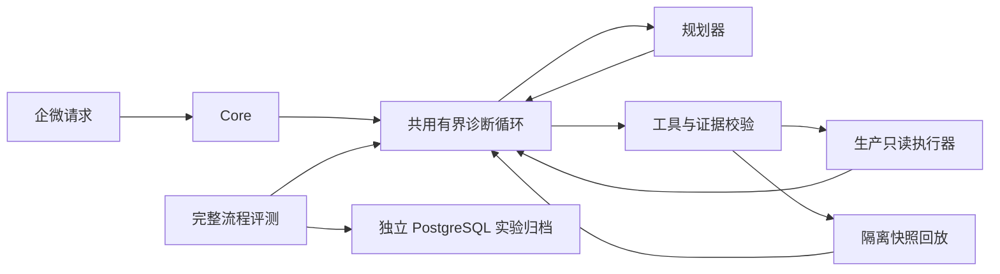

# 第二期 M2：结构化诊断与完整流程回放

验收日期：2026-10-05。M2 的工程实现及隔离验收已完成，线上第一期服务未升级。M3 的路由对照和发布尚未开始。

## 实际交付

生产 `Core` 与评测调用同一个 `run_diagnosis`。每轮最多 5 次规划、5 次只读工具调用，总时间不超过 60 秒；生产入口的总计时还包含意图识别。工具错误占用次数，重复相同参数的检查会停止，超时保留已有证据，没有额外的无限重试或总结请求。会话失效会中止任务。

模型最终输出包含假设分类、描述、置信等级、证据编号、尚未确定事项及待验证的只读工具。模型只看到当前问题、证据和服务目录，不会收到评测期望答案。引用不存在的证据、缺少结构化结论或使用未登记目标时，程序停止并保留工具证据。停止原因来自程序，用户看到的验证工具能力说明也由程序生成，例如 stats 明确只支持实时采样。

证据编号存在不等于语义正确。假设内容仍需结合原始证据判断；工具错误也是证据，但只能说明检查失败。分类码和必需工具的评分仅衡量契约，不证明完整自然语言结论准确。

图中两种读取接口由调用方注入；评测进程不持有生产执行器或 Docker socket。

## 真实运行与失败复核

故障采集使用随机名称的独立 Compose 项目、内部网络、只读根文件系统、非 root 用户、全部 capability 移除、64 MB 内存和 0.25 CPU 上限，无宿主机端口、业务卷或外部依赖。三个容器分别以退出码 7、3、2 模拟主动退出、容器内依赖连接失败、必要配置缺失。采集结束即删除测试项目和网络。

只将容器状态、退出码、OOM 标记和日志白名单字段规范化为虚构服务 `blog/web`，不会发送完整 inspect、环境变量或挂载信息。DeepSeek 容器只挂载模型密钥和评测文件，不挂载数据库、企微凭据或执行器 socket。

| 运行 | 冻结代码 | 控制回放 | 真实模型场景 | 模型请求 | tokens |
| --- | --- | --- | --- | --- | --- |
| 初版回放环境 | `e89e18b` | 8/8 | 1/3 通过全部断言 | 11 | 18643 |
| 修正回放环境 | `0c365c4` | 8/8 | 3/3 通过全部断言 | 11 | 18040 |

两轮都是 `deepseek-flash`、提示 `v4-structured`，共 22 次真实模型请求、36683 tokens；未配置核验价格，费用保持 null。控制回放是预设规划输出，不使用模型，不可将 8/8 当成模型成绩。

首轮 exit 场景的模型要求 200 行日志，而夹具只有精确匹配的 100 行工具快照，随后重复检查被程序拦截；dependency 场景虽然得出了依赖不可用的假设，却请求了未提供的健康及其他服务快照。因此首轮失败包含环境覆盖不足，不应全算模型推理错误。

第二轮增加明确完整的日志快照，复用生产分页函数支持行数和字面关键词过滤；不为没有时间戳的快照虚构时间过滤结果。服务目录限制为该隔离环境实际建模的服务，并提供未配置健康地址的确定性结果。没有修改提示或标签，两个版本和首轮失败全部保留。**数据环境发生变化，这不是严格配对的模型提升实验；3 个已知场景也不足以声称诊断准确率达到 100%。**

人工复核由开发助手完成，尚无独立标注人。第二轮通过样本仍有语义局限：把非 OOM 退出解释为自行终止，证据不足以排除其他退出机制；个别验证问题认为 inspect 能查看具体配置值，实际工具并不暴露配置。产品输出只展示程序生成的真实工具能力，不展示这些模型验证问题；原始字段保留在评测报告中供后续改进。

M1 是路由／单步契约，M2 是完整只读诊断循环，二者分数不能直接比较。本次改进前后可以确认的行为变化是：自由总结改为结构化结论、程序固定停止提示、未知引用被拦截、完整轨迹可回放、运行结果可持久归档。独立新场景上的效果提升仍需后续实验。

## PostgreSQL 归档和恢复

服务器现有 PostgreSQL 容器中新增独立数据库 `vey_eval`，不向第一期 `vey` 或其他业务数据库写入实验数据。包含：

- `vey_eval.runs`：运行 ID、归档 schema 版本、数据／实现哈希、完整规范化报告、归档时间。
- `vey_eval.samples`：运行 ID、案例 ID、重复编号、评分状态及逐步轨迹／证据／模型用量。

模型提示、数据快照和代码版本继续保存在 Git；PG 是实验查询和历史记录存储。只导入经过脱敏的报告，不导入密钥、完整容器配置或模型内部思维链。

`vey_eval_owner` 拥有归档结构，初始化后关闭 LOGIN；`vey_eval_writer` 仅有归档 schema 的 USAGE、表的 SELECT/INSERT，没有 UPDATE、DELETE、建表或创建角色权限。导入运行与样本使用事务，相同运行和相同报告重复导入不会新增，运行 ID 相同但内容变化会拒绝。

已导入 M1 四次和 M2 四次运行，共 **8 次实验、222 条样本**。服务器真实权限查询确认读取／插入允许、修改／删除禁止；本地隔离 PG 测试还以受限角色实际执行了被拒绝的操作。

已生成 PostgreSQL 自定义格式备份 `vey_eval-20261005.dump`，恢复到临时数据库后，运行数、样本数和全部报告哈希汇总一致；临时恢复库随后删除。该备份为手动快照，尚未配置定时或异地备份。

服务器归档写入凭据在 `/opt/vey-evaluations/.credentials/archive_writer_url`，仅服务器保留；不要提交到 Git 或放入模型容器。备份位于 `/opt/vey-evaluations/0c365c4/`，仅管理员读取。

## 验收产物

- [首轮真实模型报告](../evals/reports/2026-10-05-trajectories/e89e18b/results/live/report.json)与[修正后报告](../evals/reports/2026-10-05-trajectories/0c365c4/results/live/report.json)。
- [8 个完整控制回放](../evals/reports/2026-10-05-trajectories/0c365c4/results/scripted/report.json)。
- [Docker 故障采集记录](../evals/reports/2026-10-05-trajectories/0c365c4/captured/capture.json)。
- [归档、权限及备份恢复验证](../evals/reports/2026-10-05-trajectories/0c365c4/archive-verification.json)。

各运行目录保留原始 `dataset.json`、规范化哈希、实现哈希和 `report.json`。模型运行已结束，不为得到更好结果继续重跑。后续 M3 应增加新的未调参场景，并进行独立复核。
