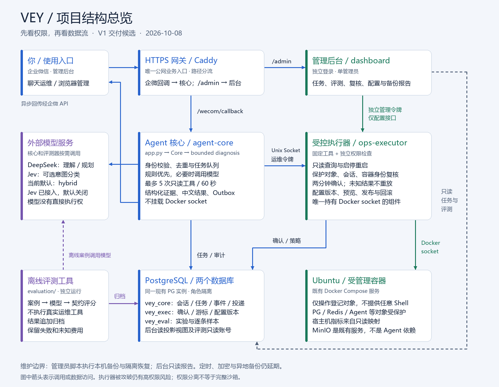
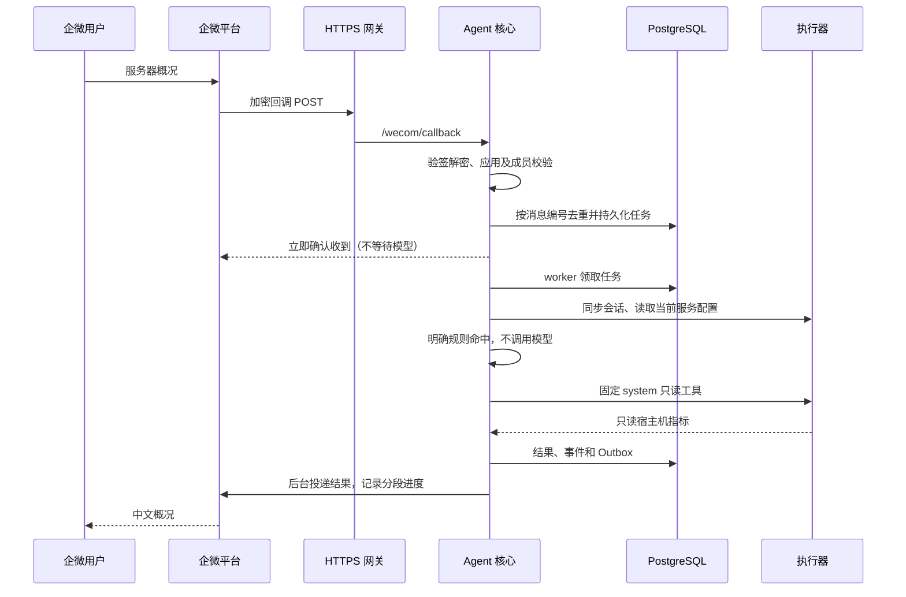
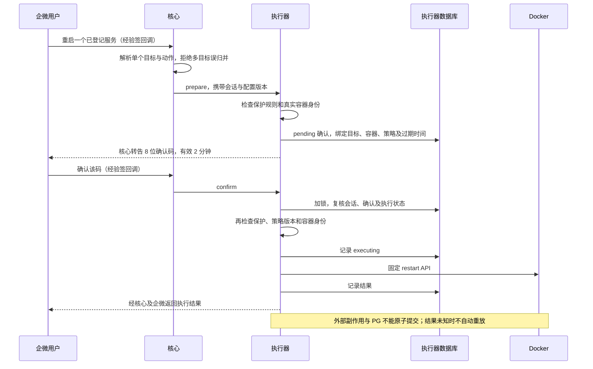
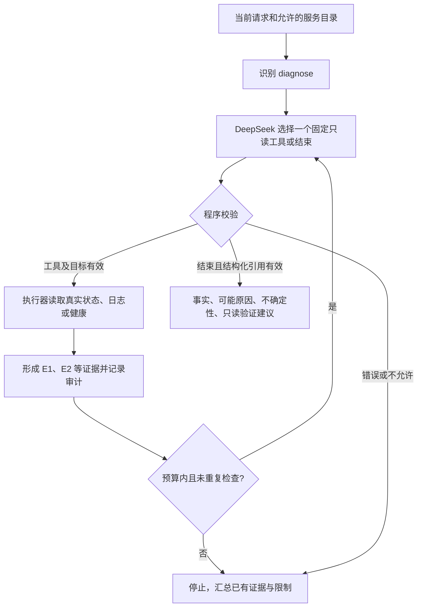
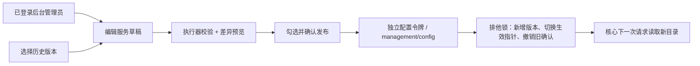

# Vey 项目结构与阅读指南

2026-10-08，根据当前源码和生产部署核对。先理解一件事：**核心负责理解和组织工作，执行器负责判断是否允许并实际执行；模型只提出结构化建议。**



可下载 [PNG](assets/vey-architecture.png) 或可编辑的 [SVG](assets/vey-architecture.svg)。图的生成脚本是 [render_architecture.py](../scripts/render_architecture.py)，使用可选 Pillow 和中文字体，不属于服务运行依赖。

## 一、部署中有哪些进程

| 组件 | 做什么 | 持有什么权限 |
| --- | --- | --- |
| `https-gateway` | Caddy 处理 HTTPS；企微回调交给核心，`/admin` 交给后台 | 公网 443；无 Docker socket、模型或数据库凭据 |
| `agent-core` | 身份、去重、会话、任务队列、规则／模型路由、有限诊断、结果投递 | 核心数据库账号、企微及模型 Key、运维令牌；无 Docker socket |
| `ops-executor` | 固定只读工具、确认后启停重启、保护清单、配置版本 | 唯一持有 Docker socket 的 Vey 服务；执行器数据库账号、运维和配置令牌 |
| `dashboard` | 任务审计、实验、快照导出／离线复核、备份报告、服务配置 | 运行数据投影视图和评测库只读账号；独立配置令牌，不能消费运维确认 |
| 既有 PostgreSQL | 两个数据库保存运行事实和实验产物 | 不随 Agent 新建或重启；按数据库角色隔离 |
| 外部模型 API | DeepSeek 理解及规划；可选 Jev 分类 | 接收脱敏输入、返回结构化数据；不能直接操作本机 |

四个 Vey 服务属于独立 Compose 项目。PG、Redis、MinIO、nginx 等是服务器原有组件；Vey 使用 PG，但没有引入 Redis 任务队列，也不依赖 MinIO 存储 Agent 数据。已有 MinIO 域名反向代理属于旁路访问，不经过 Agent 决策。

执行器的 Docker socket 权限仍接近宿主机 root。这是需要保护的高权限进程；白名单、独立 UID 和容器限制不能保证其被攻破后仍完全隔离宿主机。

## 二、三条最重要的请求流程

### 1. 查询：以“服务器概况”为例



入口在 [app.py](../src/vey/app.py) 的 `callback`；核心是 [Core.accept / process / send_pending](../src/vey/core.py)。企微回调、普通任务、确认控制和投递分开处理，慢模型不会占着回调等待。

### 2. 修改：以“重启某个服务”为例



核心不会把自然语言直接拼成 Shell。`prepare` 不修改 Docker；只有确认通过后才调用固定 API。受保护对象会在工具层拒绝，即使模型认为该执行也无效。确认、重复请求、容器变化及未知结果的实现集中在 [executor.py](../src/vey/executor.py)。

### 3. 诊断：以“为什么访问异常”为例



[diagnosis.py](../src/vey/diagnosis.py) 是显式、有预算的循环：最多 5 次规划调用和 5 次工具调用；核心普通检查总上限 60 秒。错误和补查同样占预算，不额外无限总结。日志与工具输出视为资料，不赋予指令权限。引用校验不保证自然语言语义一定正确，保留已知失败样本。

## 三、后台配置为什么可以写，运维操作却不能从后台执行



[configuration.js](../src/vey/dashboard_assets/configuration.js) 管理草稿和预览有效期；[configuration_client.py](../src/vey/configuration_client.py) 只能访问限定配置路径；[policy_registry.py](../src/vey/policy_registry.py) 执行保护基线、预览签名、容器核验和版本事务。

后台的数据库账号仍只读，配置写入交由执行器完成。管理令牌和运维令牌不同，不能互换；数据库版本记录仅追加。回滚会产生新版本，不能复活旧确认。配置发布与执行通过共享／排他咨询锁协调；有 executing 或 unknown 操作时拒绝发布。

<a id="storage"></a>
## 四、数据具体放在哪里

| 位置 | 内容 | 用途 |
| --- | --- | --- |
| `vey` 库 / `vey_core.sessions` | 会话代次、15 分钟有效期、有限上下文 | 判断当前消息属于哪次会话 |
| `vey_core.tasks` | 去重消息编号、任务状态、输入和有限结果 | 任务领取、追踪及恢复处理 |
| `vey_core.events` | 意图、工具、模型用量、诊断及操作事件 | 审计与后台时间线 |
| `vey_core.outbox` | 待投递内容、重试和分段进度 | 解耦业务处理与企微发送 |
| `vey` 库 / `vey_exec.sessions` | 执行器认可的会话及代次 | 独立校验会话失效 |
| `vey_exec.grants` | 确认码、目标、动作、容器快照、状态及结果 | 二次确认及副作用追踪 |
| `vey_exec.log_cursors` | 绑定会话和容器的日志分页游标 | 有界分页，不扫全历史 |
| `vey_exec.policy_versions / policy_state` | 不可变版本历史及当前指针 | 配置发布、审计和回滚 |
| `vey` 库 / `vey_dashboard` 视图 | 经过筛选的任务、事件和操作数据 | 后台无需读取原始表全部字段 |
| `vey_eval` 库 / `vey_eval.runs / samples` | 实验来源、配置、评分、逐项结果 | 比较模型方案、复核失败 |
| 根维护配置和秘密文件 | 初始保护基线、数据库连接和 API Key | 只读挂载，保留在服务器，不进入 Git |
| `operations-reports/` | 脱敏维护报告 | 后台显示容量和演练状态 |
| `/opt/vey-backups/` | 数据库 dump、配置包和私有恢复清单 | 管理员备份恢复，不挂载到后台 |

常规运行审计保留 30 天；会话输入与上下文更早失效清理。评测报告和配置版本按各自历史规则保留。Outbox 与企微外部 API 不能做跨系统事务，所以仍存在响应丢失导致重复投递的窗口，不宣称 exactly-once。

## 五、源码目录怎么读

```text
Vey/
├─ src/vey/
│  ├─ cli.py                         启动 core / executor / dashboard
│  ├─ app.py、wecom.py                企微回调、加解密与发送
│  ├─ core.py                        会话、任务、控制队列、编排、Outbox
│  ├─ model.py、jev.py                DeepSeek 与可选 Jev 路由
│  ├─ diagnosis.py                   有预算的只读诊断循环
│  ├─ domain.py、config.py            数据契约、设置与保护基线
│  ├─ executor_client.py              核心到执行器的 Unix socket 客户端
│  ├─ executor_app.py、executor.py    执行器入口、确认状态与权限检查
│  ├─ docker_backend.py              固定 Docker SDK 调用
│  ├─ system_info.py、logs.py         宿主机指标与有界日志
│  ├─ policy_registry.py             版本化服务配置
│  ├─ db.py                          ORM：运行库两个 schema
│  ├─ security.py、presentation.py    脱敏、鉴权及中文结果展示
│  ├─ dashboard.py、dashboard_db.py   后台身份与数据读取
│  ├─ configuration_client.py        受限配置管理客户端
│  ├─ operations_report.py           脱敏维护报告读取
│  ├─ replay.py                      审计导出校验、离线 HTML 复核
│  ├─ dashboard_assets/              原生 HTML / CSS / JavaScript
│  └─ evaluation/                    路由评分、诊断轨迹、PG 归档与读取
├─ migrations/                       Alembic，当前 schema 版本 0003
├─ config/vey.example.toml            部署配置模板，不含真实凭据
├─ compose*.yaml                     基础组件与 HTTPS/后台/Jev 等覆盖配置
├─ deploy/                           Caddy 路由及网关镜像
├─ scripts/                          数据库初始化、验收、备份恢复与人工核对
├─ tests/                            自动测试和独立测试服务 fixture
├─ evals/datasets/                   版本化合成案例
├─ evals/reports/                    保留的脱敏实验与验收结果
├─ docs/                             设计、部署、验收、演示及架构图
└─ .github/workflows/ci.yml           测试、静态检查及离线评测
```

建议阅读顺序：`domain.py` 看允许做什么 → `app.py` 看消息怎么进来 → `core.py` 看如何组织任务 → `executor.py` 看为什么不会直接执行任意指令 → `diagnosis.py` 看 Agent 循环 → `evaluation/` 看怎样证明效果 → `dashboard.py / policy_registry.py` 看管理能力。

## 六、当前取舍

- 使用普通 Python 控制流与 Pydantic 契约构造 Agent，未引入 LangChain、LangGraph 或多 Agent 协作框架。
- 单实例核心使用 PG 队列与独立控制循环，暂不引入 Redis/Celery；未验证水平扩容与高并发。
- Jev 已真实接入，但本组对照没有获得速度收益，因此默认 hybrid；[完整原始结果](evaluation.md#jev-results)可复核。
- 后台保留原生前端，避免为有限页面引入额外构建与部署链。
- 现阶段没有自动修复、任意 Shell、镜像更新／删除、无人确认的变更或主动告警。
- [V1 交付清单](v1-delivery.md)区分可用能力、实际验收与延期项；浏览器验收未通过工具完成之前不标记全量验收完成。

<a id="technology"></a>
## 七、技术选型与理由

| 选择 | 在本项目中的用途与理由 |
| --- | --- |
| Python 3.13、FastAPI、Uvicorn | 统一实现消息 API、工具适配和模型编排，适合以 I/O 等待为主的个人运维服务 |
| Pydantic 2、HTTPX | 严格校验结构化参数；统一 HTTP 连接池、超时、取消和提供方适配 |
| PostgreSQL、SQLAlchemy、psycopg、Alembic | 复用既有实例；通过独立角色、事务、唯一约束和锁管理任务、确认、配置版本与审计 |
| 显式控制流、asyncio、PG 任务表与 Outbox | 有限工具循环与可追溯状态足以满足当前单实例规模；消息接收、处理和回复解耦 |
| Docker SDK、Unix socket | 调用固定结构化 API，不拼接 Shell；将持有 Docker 权限的执行器单独运行 |
| `/proc`、statvfs 的只读适配 | 获取宿主机采样；缺失的挂载或指标明确报告，不把容器指标冒充宿主机 |
| Docker Compose、Caddy | 独立管理各服务身份、挂载和网络，提供 HTTPS 入口 |
| 原生 HTML/CSS/JavaScript | 后台页面有限，无额外前端构建链；通过独立账号和管理令牌限制权限 |
| uv、Ruff、pytest、GitHub Actions | 锁定依赖，验证参数、状态、真实 PG 权限与失败边界 |

SQLite 并非因为使用文件而不可靠；这里选择 PG，是已有实例、多进程访问、权限隔离和后续评测共同决定的。单机 PG 仍不等于高可用。

Docker SDK 同步调用使用有界工作线程和网络超时；协程取消不代表 Docker 已停止，结果不确定时进入 unknown 并由管理员核对。具体操作见[部署手册](deployment.md)，数据备份见[恢复手册](operations-recovery.md)。
