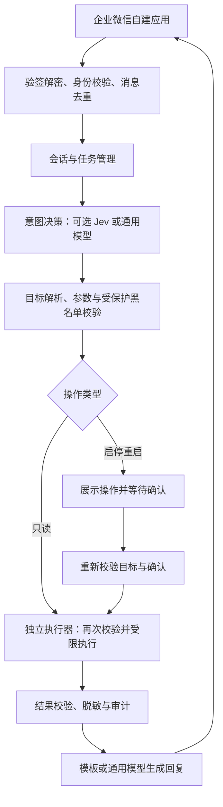

# 个人服务器运维 Agent 需求文档

版本：v0.7

日期：2026-10-04

状态：第一期需求基线；用户已授权开发，本地实现与验收进度见 [开发记录](development-plan.md)。

配套文档：[技术选型与架构方案](technical-design.md)。技术选型为当前建议，用户已确认的功能需求仍以本文为准。

长期规划：[三期建设路线与数据设计](roadmap-and-data.md)。本文的第一版范围对应第一期，后两期能力不自动并入第一期验收。

## 1. 产品目标

通过企业微信自建应用，为个人提供自然语言服务器运维入口。在手机上完成 Ubuntu 服务器状态查询、Docker Compose 服务排查和受控启停重启，减少日常操作对 SSH 终端的依赖。

项目同时用于 AI 应用／Agent 开发方向求职，按三期逐步建设可靠运维闭环、可评测诊断能力和可展示的完整应用；以真实运行、失败分析和可复现实验体现工程能力。

系统应根据真实工具结果回答问题：说明查到了什么、执行了什么、验证到了什么，以及仍然无法确定的事项。不能将模型推测当成已确认的故障原因，也不能将请求已提交当成操作成功。

## 2. 需求状态与已确认范围

本文中的“已确认”来自用户明确选择；“权限设计”依据用户授权由方案制定者确定；其余未确认的细则明确标为建议或待确认。待确认项不能被视为已获授权。

| 项目 | 状态 | 内容 |
| --- | --- | --- |
| 使用者 | 已确认 | 用户本人，管理个人服务器 |
| 长期目标 | 已确认 | 面向 AI 应用／Agent 开发求职，分三期逐步完善 |
| 操作系统 | 已确认 | Ubuntu；部署环境已核实为 22.04.5 LTS |
| 容器管理 | 已确认 | 使用 Docker Compose |
| 聊天入口 | 已确认 | 企业微信自建应用，与应用单独对话 |
| 第一版功能 | 已确认 | 查询、排查、启动、停止、重启 |
| 网络条件 | 已确认并接通 | 已完成域名备案、HTTPS 及企微公网回调接入 |
| 当前工作阶段 | 已确认 | 第一期已交付：功能部署、自动验收、真实桌面企微客户端查询与确认重启均完成，详细证据见开发进度 |
| 管理拓扑 | 建议默认 | 单机部署，仅管理 Agent 所在服务器 |
| Jev | 已确认 | 第一版不强制接入，做好意图决策接口抽象即可 |
| 日志查询 | 已确认 | 默认最近 100 行，无默认时间筛选；每次最多 500 行、10000 字符，截断提示并支持翻页 |
| 排查边界 | 已确认 | 最多 5 次只读工具调用、检查阶段最多 60 秒，任一上限达到即停止并汇总；重试和翻页也计数 |
| 操作确认 | 已确认 | 短任务编号、一次确认、2 分钟有效、仅消费一次 |
| 会话上下文 | 已确认 | 连续 15 分钟无有效用户新消息则清空，用户新消息刷新计时；支持“清空上下文”指令 |
| 审计保留 | 已确认 | 操作审计记录保留 30 天，与会话上下文分开管理 |
| 数据出站 | 已确认 | 允许将限定范围且脱敏后的日志、系统信息发送至所配置的外部模型 |
| 受保护对象 | 已确认 | Agent 自身及 Redis、数据库等实际依赖组件；工具层黑名单拒绝启动、停止、重启 |
| Agent 部署 | 已确认 | 独立 Compose 项目 |
| Docker 权限 | 已授权制定 | 使用独立系统身份，按第 5 节将对话进程与高权限执行器分离 |
| 通用模型 | 已确认 | DeepSeek；通过密钥文件注入，模型名称可配置 |
| 数据库 | 已确认 | 复用服务器现有 Docker 中的 PostgreSQL，使用专用数据库和独立运行角色 |

## 3. 典型使用场景

| 场景 | 用户表达 | 预期结果 |
| --- | --- | --- |
| 日常查看 | 服务器现在怎么样？ | 汇总 CPU、内存、磁盘、负载和异常容器 |
| 资源排查 | 哪个服务最占内存？ | 返回容器资源排行，必要时提供进程排行 |
| 服务状态 | 博客还在运行吗？ | 返回服务对应容器的运行状态和健康状态 |
| 日志查询 | 看看博客最近十分钟的报错 | 返回限定范围内的日志摘要和关键原文 |
| 故障排查 | 博客为什么访问不了？ | 连续执行必要的只读检查，给出证据和下一步建议 |
| 多轮追问 | 再看看它的数据库 | 结合上下文定位；存在歧义时先澄清 |
| 服务操作 | 重启一下博客 | 明确目标、请求确认、执行、检查并报告结果 |
| 操作追溯 | 刚才的重启成功了吗？ | 根据任务记录返回执行与验证状态 |

## 4. 第一版功能需求

### 4.1 企业微信入口与身份识别

- 接收用户在自建应用会话中发送的文字消息，并回复处理结果。
- 仅允许配置的个人企微用户身份访问运维能力；不能依赖用户在消息中自报身份。
- 接入层需完成消息真实性校验、解密和重复消息识别。
- 消息接收与长时间排查分开处理，避免等待模型或工具时阻塞接收流程。
- 较长任务提供已受理提示，结束后发送结果；重复回调不得重复执行同一操作。
- 第一版不要求群聊、语音、图片理解或网页管理后台。
- 开发阶段规划本地文字调试入口，复用身份、权限和工具校验逻辑；公网入口不得提供绕过认证的调试功能。

### 4.2 系统信息查询

- 查询 CPU 使用率、系统负载、内存与交换空间使用情况、各挂载点磁盘使用情况、系统运行时间。
- 查询主要进程和容器的资源占用排行。
- 提供服务器概况汇总，并注明采集时间。
- 瞬时采样结果应说明采样范围，不能凭一次采样断言长期趋势。
- 异常提示阈值应可配置；具体默认阈值待实现设计时确定。
- 第一版不建设长期指标数据库或历史监控图表。

### 4.3 Compose 项目与服务识别

- 管理范围由显式配置的项目目录和服务清单限定，不自动将所有发现的资源纳入可操作范围。
- 操作对象以“项目＋服务”为主，并解析到实际容器。
- 支持人为配置中文别名，例如“博客”对应 `blog` 项目的 `web` 服务。
- 同名服务、别名冲突或上下文不明确时，先列出候选并澄清。
- 一个服务有多个实例时，展示实例数量和实际操作范围，不能默认为任意一个实例。
- 查询服务运行状态、健康状态、退出码、重启次数、镜像、端口和资源占用。
- 配置详情采用字段白名单，默认不展示环境变量值、认证信息等敏感字段。
- 没有健康检查时明确显示“未配置”，不能将其解释为健康检查通过。

### 4.4 日志查询

- 支持按项目、服务、时间范围、关键词和条数检索容器日志。
- 默认查询最近 100 行日志，不设置时间范围筛选；用户明确指定时间范围时才应用该条件。
- 单次查询硬性上限为 500 行、10000 字符，任一条件先达到即停止本次输出；多实例合并结果共同使用该额度，不能为每个实例单独放大额度。
- 字符按 Unicode 码点计数，中文、英文、标点、空格和换行均计入，不按 UTF-8 字节或模型 token 计数。该口径属于建议细则。
- 字符限制同时约束返回工具结果和供模型分析的本次日志内容；脱敏后若内容变长，仍需满足上限。原始读取应采用流式限额，不能先把全部历史日志载入内存。
- 不限制默认时间范围不等于不限读取耗时；日志工具仍受单次超时和任务预算约束。
- 达到硬性上限时明确告知“日志已截断”，说明触发了行数还是字符限制，并提示可继续翻页。
- 支持“下一页”或“更早的日志”；建议首屏显示最近内容，后续向更早的记录翻页，每页都独立遵守 500 行和 10000 字符上限。普通分页不默认意味着硬上限截断。
- 建议固定本次查询的截止位置和分页游标，包含项目、服务、实例、筛选条件与读取位置，避免新日志写入造成跳页或重复；超长单行按字符位置续读，防止永远卡在同一行。
- 日志轮转、容器替换或游标过期使继续读取不可用时，应明确说明并提示重新查询，不伪造缺失日志。分页缓存也需容量限制和过期清理。
- 不自动连续翻页拉完整历史；用户请求下一页或排查任务确有需要时才能继续，自动排查中的翻页消耗工具调用预算。
- 默认返回简短摘要和关键原文，允许继续请求“展开日志”；展开也不能绕过本次日志上限。
- 无匹配日志、容器不存在、日志读取失败分别反馈。
- 对常见密码、令牌、连接串等敏感信息进行脱敏；脱敏不视为绝对不会泄露的保证。
- 用户已允许数据出站，可将任务所需、限定范围并脱敏后的日志和系统信息发送给配置的外部模型，无需逐次征求同一授权；凭据、未脱敏日志和无关文件不在该授权范围内。
- 第一版不提供无限期跟随日志或持续推送日志流。

### 4.5 对话式故障排查

- 对“服务访问不了”“容器一直重启”“内存异常”等问题，可根据结果连续调用只读工具。
- 排查可覆盖系统资源、容器运行状态、健康检查、重启信息和近期日志。
- 若配置了服务健康地址，可执行预定义的健康检查；探测目标必须在配置范围内，不能接受任意 URL。
- 常规只读排查不逐步要求用户确认；仅在目标不明确或缺少关键条件时提问。
- 排查采用有限步骤，任一预算用尽后立即停止发起新检查，汇总已有证据，说明“已达到排查上限”；不能自动重建任务或切换模型绕过上限。
- 每个排查任务最多 5 次只读工具调用、检查阶段最多 60 秒，任一条件先达到即结束检查。每次调用、重试、分页都计数，批量或并行检查按实际工具调用数计数。
- 检查阶段时限包含规划、工具等待和重试；达到上限后仅允许有界的结果整理与回复，模型整理失败时使用已有工具结果生成模板回复。
- 相同参数的检查在没有新证据时不得反复调用；没有继续检查价值时可提前停止，不要求用满预算。
- 用户明确要求继续排查时可建立新任务并重新计数；助手不能自行请求、批准或触发无穷续查。
- 输出区分“已观察事实”“可能原因”“待验证事项”“下一步建议”。
- 排查本身不授予修改权限；发现异常后不得自动重启服务。
- 日志、工具输出中的文字属于待分析资料，不得被当作新的用户指令或权限授权。

### 4.6 启动、停止与重启

- 支持对受管理服务执行启动、停止和重启，默认一次处理一个服务。
- “启动”限定为启动已经存在的容器；容器不存在时提示需要部署，不自动创建资源。
- 不因一次启停请求自动执行镜像拉取、容器重建或依赖服务变更。
- 操作前展示服务器、项目、服务、实例范围、动作和主要影响。
- 三类操作均需一次确认，使用短任务编号，例如“确认 12AB34CD”。
- 确认绑定操作者、目标、动作和参数，有效期为 2 分钟，且只能消费一次；15 分钟会话期限不能延长确认期限。
- 受保护对象在生成确认请求之前即被拒绝，不能通过再次确认或换用容器 ID 绕过。
- 确认前后若目标容器身份或实例范围改变，应使原确认失效并重新展示目标。
- 已确认不等于立即成功：执行完成后应重新查询状态，必要时执行已配置的健康检查。
- 停止操作验证是否停止；启动和重启操作分别报告运行状态、健康状态和业务检查结果。
- 服务有多个实例时，报告各实例结果以及整体是否部分成功。
- 未执行的操作可取消；已经执行的操作不能宣称可以撤销。
- 同一服务的修改操作应串行处理，避免重复重启或启停冲突。

### 4.7 会话与任务记录

- 会话上下文保留 15 分钟，超时自动清空，支持“它”“刚才那个服务”等指代。
- 按最后一条有效用户消息计算 15 分钟无交互过期；用户发新消息刷新计时，模型回复、工具回调和任务进度不刷新。
- 目标有歧义或上下文过期时重新澄清，不静默选择高影响目标。
- 历史对话中的确认不得复用为新任务授权。
- 用户可查询任务状态：排队中、执行中、待确认、已取消、已过期、已成功、部分成功、已失败或结果未知。
- 支持手动发送“清空上下文”，通过确定性指令处理，无需模型判断或额外确认。
- 清空上下文时清除对话、当前指代及关联的分页游标，并使未消费的确认失效；不删除审计记录，也不能撤销已经执行的操作。此关联清理为建议细则。
- 超时或主动清空后，旧任务结果仍可保留用于查询，但不能自动重新注入新会话或恢复旧确认。
- 普通回复优先提供手机上易读的结论与关键数据，更多详情通过追问展开。

### 4.8 审计记录

- 记录任务编号、消息标识、操作者、接收时间、规范化意图、目标、参数、确认记录、工具调用、执行结果和验证结果。
- 记录拒绝原因、超时和模型不可用等异常。
- 审计记录不保存 API 密钥或未脱敏的敏感配置；不默认长期保存完整容器日志。
- 审计记录保留 30 天，按日期轮转，并设置容量上限；容量值在部署设计时根据磁盘预算确定。15 分钟上下文期限不适用于审计。

## 5. 权限与执行边界

以下权限设计依据用户“由你规定操作权限”的授权制定，作为后续实现约束，不能由模型置信度覆盖。实际部署权限与隔离验证结果见服务器验收记录。

1. 模型只能提出预定义工具调用，执行层独立校验身份、工具、目标和参数。
2. 第一版不开放任意 Shell、任意容器内命令、任意文件读写或模型生成的脚本执行。
3. 禁止删除容器、镜像、网络和卷，禁止清理数据、修改 Compose 文件或宿主机配置。
4. 第一版不开放系统重启、关机、Docker 服务重启或整套项目销毁操作。
5. Agent 自身、独立执行器及其 Redis、数据库等实际依赖组件列为受保护对象；工具层对其启动、停止和重启直接拒绝。该范围不表示必须引入 Redis 或独立数据库。
6. Docker 访问能力属于高权限能力，按下文分离运行身份和执行职责，不能仅依赖提示词、非 root 用户名或容器内运行来宣称安全。
7. 查询结果应先限制范围并脱敏，再决定是否用于模型分析和回复。

### 5.1 独立系统身份与执行器

Docker 官方明确说明，默认 rootful Docker 下，`docker` 用户组授予 root 级别权限。因此，“独立用户仅加入 docker 组”有助于区分运行身份，但本身不能限制该用户只能查看或重启指定容器。[Docker 官方说明](https://docs.docker.com/engine/install/linux-postinstall/)

确定采用以下权限分工：

| 组件 | 运行身份及权限 | 边界 |
| --- | --- | --- |
| 企微接入、会话与模型编排 | 独立非 root 身份，不加入 docker 组，不具备 sudo 权限 | 不挂载 Docker socket，不访问宿主机 Docker API，只调用受限执行器接口 |
| 运维执行器 | 单独非 root 系统身份，必要的附加组仅包含 docker，不具备 sudo 或交互登录权限 | 仅此组件获得 Docker socket 访问，内部独立执行动作、目标、参数和确认校验 |
| 权限配置与受保护清单 | 由服务器管理员维护，运行进程只读 | 对话、模型和执行器均不能自行修改清单或扩大权限 |

- 上述组件可作为同一个独立 Compose 项目内的不同服务；容器的实际 UID/GID 和附加组需显式配置，不能仅依赖运行 Compose 命令的宿主机用户名。
- 执行器仅提供具体业务操作，不提供通用 Docker API 转发、任意路径、命令文本、创建容器、exec 或构建镜像接口。
- 执行器仅通过本地受限通信通道访问，不发布公网端口；校验调用方身份，修改接口还应验证与目标绑定的一次性确认记录，不能接受模型自报的“已确认”。
- 读工具只返回必要且脱敏的字段；系统采集采用固定只读能力，不为查询开放任意主机文件或进程环境读取。
- 执行器仍持有高权限 Docker 能力，是必须重点保护和验证的组件；该设计减少高权限暴露面，不承诺执行器被攻破后仍能保护整个宿主机。

### 5.2 受保护服务清单

- 执行顺序为身份校验、动作白名单、目标解析、受保护黑名单、参数与确认校验；默认拒绝未知动作和未登记目标。
- 黑名单优先于项目管理白名单，覆盖别名、项目服务名和最终容器 ID；一个操作范围包含任意受保护实例时整体拒绝。
- Agent 自身 Compose 项目及实际外部依赖都须纳入清单；额外共享入口服务由用户登记。读取状态和脱敏日志仍可在查询白名单内允许。
- 清单缺失、无法解析或校验失败时拒绝修改操作，不能降级成无保护执行。
- 第一版通过受权限保护的配置文件维护。管理后台编辑清单列为后续功能，第一版不建设后台，也不允许通过聊天移除保护。

## 6. Jev 与通用模型的职责

### 6.1 Jev 的定位

根据 TypeSafe 官方文档，Jev 面向基于状态的结构化决策，提供 Choice、Score 和 Noul 三类问题；它不承担生成自然语言说明的职责。

第一版不强制接入 Jev，只定义可替换的意图决策接口，由通用模型或确定性规则实现当前流程。接口输出规范化意图、解析状态及必要的决策元信息；不能要求所有提供方都输出可比较的置信度。

未来接入 Jev 时，可用于范围明确的意图分类，例如区分系统查询、服务查询、日志查询、故障排查、服务操作和未知请求。具体 SDK、凭据和线上调用不属于第一版必需交付物。

- 分类结果用于选择处理流程，不直接变成执行授权。
- Jev 不单独承担开放参数抽取；服务、时间范围等参数仍需解析和程序校验。
- 低置信度或未知请求进入澄清或通用模型处理流程。
- Choice 和 Score 的 confidence 来自概率分布，不能解释为实际正确率或安全保证。
- 不预设“高于某个数值就允许重启”；操作确认始终由固定规则控制。
- 中文运维指令、含糊指代、否定表达和多意图请求需要单独评估识别效果。
- “高速”属于待验证收益，应测量端到端延迟，不提前承诺效果。

### 6.2 通用模型的定位

建议由通用模型负责自然语言理解、复杂参数解析、只读排查规划、日志解释和结果表达。所有工具调用均经过相同的权限和参数校验。

Jev 作为可选扩展提供方：没有 Jev 凭据或 SDK 时，第一版仍必须能启动并完成全部核心流程；不得每条消息固定额外调用 Jev。未来启用后，超时与降级策略需在技术设计时确定。无论采用哪种模型路径，修改操作的确认要求保持一致。

通用模型不可用时，应明确告知能力受限；结构化状态查询可规划为确定性的查询入口，不能伪造分析结果。

### 6.3 概念流程

该流程表达职责与权限分离，不确定编程语言、数据库、队列或框架。独立 Compose 项目部署已确定。

## 7. 失败处理与可用性

| 情况 | 预期行为 |
| --- | --- |
| 未授权身份 | 拒绝请求，不泄露服务器信息 |
| 消息重复到达 | 关联已有任务，不重复执行修改操作 |
| 服务名不明确 | 返回候选并要求澄清 |
| 确认超时或重复确认 | 不执行，说明已过期或已处理 |
| Docker 不可用或权限不足 | 返回真实错误与受影响范围 |
| 修改工具调用超时 | 标记结果未知，优先查询实际状态，不盲目重试 |
| 执行成功但检查失败 | 分别报告执行结果与检查结果，不混称成功 |
| 回复发送失败 | 保留任务结果，重试回复时不再次执行操作 |
| Agent 进程重启 | 恢复任务记录；对执行中的修改任务先核对实际状态 |
| 模型不可用 | 提示能力受限，按明确的降级策略处理 |
| 排查达到步数或耗时上限 | 停止新检查，汇总已有证据，不自动续查 |
| 日志达到行数或字符上限 | 明确提示截断，允许通过有效游标继续翻页 |
| 受保护清单缺失或失效 | 拒绝修改操作，说明配置错误 |
| 整台服务器断网或宕机 | 同机 Agent 无法继续回复；外部存活监控不属于第一版 |

## 8. 部署与接入前提

- 目标服务器为 Ubuntu，具备 Docker 和 Docker Compose；实际版本、项目结构及访问权限待确认。
- Agent 独立为一个 Compose 项目，配置和审计数据持久化保存；对话进程与执行器分别按第 5 节配置运行身份和访问权限。
- 用户准备企业微信自建应用及管理权限，并配置仅本人可使用的应用范围和服务端身份白名单。
- 用户后续准备域名及相关接入条件。域名备案、HTTPS、可信 IP 等具体要求，应在正式接入前依据企微当时的官方规则和服务器部署地域核对；本文不将其统一写成已经核实的强制要求。
- 开发阶段可先通过本地调试入口验收核心流程；企微端到端验收仍需真实接入环境。
- 需要模型凭据时通过配置注入，不写入代码、需求示例或审计日志。

## 9. 第一版验收标准

| 编号 | 场景 | 通过标准 |
| --- | --- | --- |
| A01 | 查询服务器概况 | 返回工具采集的指标与采集时间，缺失信息明确标识 |
| A02 | 查询 Compose 服务 | 正确关联项目、服务和容器，不混淆同名服务 |
| A03 | 查询日志 | 默认最近 100 行，无默认时间过滤；每次最多 500 行、10000 字符，明确截断并脱敏 |
| A04 | 有限步骤排查 | 最多 5 次只读工具调用、检查阶段最多 60 秒；重试和翻页计数，任一上限达到即停止并汇总，不自动修改服务或无穷续查 |
| A05 | 启动已有服务 | 确认后启动指定目标并验证，不自动部署缺失容器 |
| A06 | 停止与重启服务 | 确认目标和范围后执行，并提供针对动作的验证结果 |
| A07 | 未确认或已过期 | 仅接受目标匹配、2 分钟内、未消费的确认，不执行其他修改请求 |
| A08 | 重复消息与重复确认 | 同一任务最多发起一次对应修改操作 |
| A09 | 非本人访问 | 无法查询服务器数据或调用运维工具 |
| A10 | 目标有歧义或发生变化 | 澄清或重新确认，不沿用不匹配的授权 |
| A11 | 工具超时或结果未知 | 不伪报成功，不盲目重试修改操作 |
| A12 | 日志含指令式文字 | 仅作为资料处理，不能改变权限或触发额外操作 |
| A13 | 无 Jev 依赖 | 不安装 Jev SDK、不提供 Jev 凭据时，仍能启动并完成查询排查和确认后操作；意图接口可替换 |
| A14 | 审计追溯 | 能查询任务的目标、确认、执行和验证结果 |
| A15 | 企微端到端流程 | 在真实应用中完成一次查询与一次确认后操作 |
| A16 | 受保护服务 | Agent、执行器及实际依赖的启动、停止、重启均被工具层拒绝，换用别名或容器 ID 也无法绕过 |
| A17 | 日志翻页 | 每页遵守双上限，正常情况下不重复、不漏读；超长行可续读，日志轮转或游标失效时明确提示 |
| A18 | 会话过期与手动清空 | 连续 15 分钟无有效用户新消息则清空，用户新消息刷新计时，助手及工具消息不刷新；“清空上下文”即时生效，旧指代和确认不可恢复使用 |
| A19 | Docker 权限分离 | 对话进程无 Docker socket/API 访问，只有执行器具备访问；禁止接口和越界目标被拒绝 |
| A20 | 数据出站 | 仅向配置的模型发送任务所需且脱敏限量的内容，不包含凭据或完整原始日志 |
| A21 | 权限配置失效 | 运行进程不能修改清单；清单无效时修改操作失败关闭 |
| A22 | 审计保留 | 操作审计保留 30 天并按期限清理；会话超时或手动清空不删除审计记录 |

## 10. 第一版之外的功能

以下仅保留为后续方向，不纳入本次交付范围：

- 拉取镜像、创建或重建容器、一句话更新服务、回滚版本。
- 修改 Compose 文件、环境变量、网络或资源限制。
- 多服务器接入、团队权限、多人审批。
- 定时巡检、主动告警、自动修复和外部存活监控。
- 任意 Shell、容器终端、文件管理。
- 网页管理后台（包括受保护服务清单配置）、语音指令、群聊入口。

## 11. 部署前待补充信息

| 事项 | 当前建议或需要的信息 |
| --- | --- |
| 实际服务清单 | Compose 项目目录、服务名、常用别名和受保护对象 |
| 模型接入 | 已选 DeepSeek；上线前配置本地密钥，核对实际账号可用模型及网络连通性 |
| 健康检查 | 哪些服务需要验证业务可用性，使用哪些预配置地址 |
| 审计存储 | 30 天保留周期已确定；容量与轮转参数在部署设计时确定 |
| 企微接入条件 | 自建应用配置、域名、网络可达性及当时适用的平台要求 |
| 技术方案 | 基础选型见配套技术方案；依赖版本、采集挂载、分页与权限隔离实现仍需在开发阶段验证，不改变已规定的身份分离边界 |

操作确认、日志数量与字符上限、排查预算、会话计时、审计保留周期、数据出站、独立 Compose 部署和受保护服务原则已经确认，不再作为开放问题反复询问。分页方向、字符计数和清空关联状态等细节采用本文所列建议，用户可继续调整。

用户已授权第一期开发与服务器 Docker／数据库验收。已部署核心及执行器、新建专用库，并仅对独立测试容器执行启停；原有业务均受保护。详见 [服务器验收记录](server-acceptance.md)。

## 12. 参考资料

Jev 资料查阅于 2026-09-23，Docker 权限资料查阅于 2026-09-25。厂商关于速度的描述不替代本项目的实际评估。

- [TypeSafe AI：Introduction](https://docs.typesafe.ai/introduction)
- [TypeSafe AI：Confidence](https://docs.typesafe.ai/confidence)
- [TypeSafe AI：Patterns](https://docs.typesafe.ai/patterns)
- [TypeSafe AI：Quick start](https://docs.typesafe.ai/introduction/quickstart)
- [Docker：Linux post-installation steps](https://docs.docker.com/engine/install/linux-postinstall/)
- [Docker：Engine security](https://docs.docker.com/engine/security/)

## 13. 修订记录

| 版本 | 日期 | 内容 |
| --- | --- | --- |
| v0.1 | 2026-09-23 | 形成第一版范围、功能和验收讨论稿 |
| v0.2 | 2026-09-25 | 纳入用户九项决定，补充日志分页、排查停止条件、会话过期、出站授权、受保护清单与 Docker 权限分离设计；保留数值及计时待确认项 |
| v0.3 | 2026-09-25 | 确认 5 次调用／60 秒排查上限、15 分钟无用户消息的会话过期口径、30 天审计保留周期；同步验收标准与待确认清单 |
| v0.4 | 2026-09-25 | 明确 AI 应用／Agent 开发求职目标，关联三期路线与数据设计；第一期功能边界保持不变 |
| v0.5 | 2026-09-25 | 更新开发授权、既有容器化 PostgreSQL 和 DeepSeek 选择；服务器接入待配置 |
| v0.6 | 2026-09-26 | 更新服务器验收状态，保留模型、企微与剩余功能边界 |
| v0.7 | 2026-10-04 | 更新实际接入、部署、自动及真实客户端验收和第一期交付状态，保持第一期功能和验收基线不变 |
