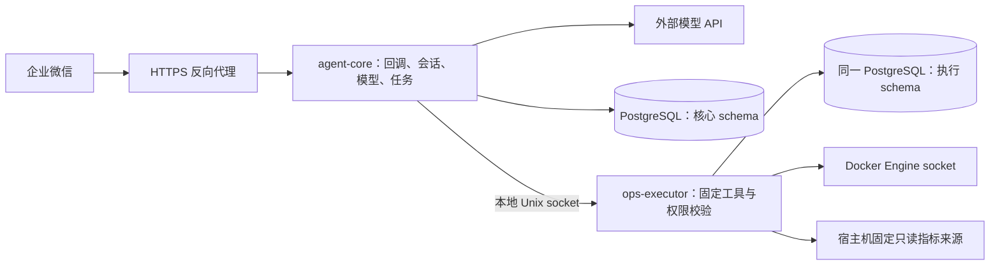

# 个人服务器运维 Agent 技术选型与架构方案

版本：v0.4  
日期：2026-09-26  
依据：[需求文档 v0.6](requirements.md)及[三期建设路线与数据设计](roadmap-and-data.md)  
状态：第一期实现方案；本地代码及隔离测试已建立，真实环境验收见 [开发记录](development-plan.md)。

## 1. 选型结论

当前推荐采用 Python 3.13、FastAPI、Pydantic 2、HTTPX、PostgreSQL、SQLAlchemy 2、psycopg 3、Docker SDK for Python 和 Docker Compose。Agent 使用显式状态机与有限工具循环，Jev 第一期仅预留适配接口。通过独立执行器落实 Docker 权限边界。

第一期不引入 Redis、Celery、向量数据库或大型 Agent 编排框架。15 分钟会话、任务恢复、操作确认与 30 天审计通过 PostgreSQL 持久化和明确的状态转换完成。评测与管理后台在第二、三期逐步加入。

方案起点是单用户、单服务器，并服务于 AI 应用／Agent 开发求职的三期建设目标。原 SQLite 方案可以满足第一期容量与低并发需求；调整为 PostgreSQL 是为了统一后续评测、后台与多进程访问的数据基础。模型调用和远端 API 等待预计比应用计算更影响交互耗时，实际延迟仍需在开发后验证。

## 2. 选型清单与理由

| 层次 | 选择 | 针对本项目的理由 |
| --- | --- | --- |
| 语言与运行时 | Python 3.13 | 可统一编写 API、工具、系统采集和模型适配；官方仍提供支持，不依赖宿主机自带 Python |
| Web 服务 | FastAPI + Uvicorn | 适合企微回调和内部结构化接口；请求模型与校验规则可统一维护 |
| 参数与配置模型 | Pydantic 2 | 定义工具参数、枚举、长度和数值边界；操作接口启用严格校验并拒绝额外字段 |
| HTTP 客户端 | HTTPX AsyncClient | 统一访问企微和模型 API，配置连接池、超时和取消；提供方差异封装在适配器内 |
| Agent 编排 | 显式状态机 + 有限工具循环 | 直接落实最多 5 次调用、60 秒检查时限、确认与停止规则，流程容易审计 |
| 数据存储 | PostgreSQL | 保存会话、任务、确认、审计，后续保存评测结果；支持多组件访问和独立数据库角色 |
| 数据访问与迁移 | SQLAlchemy 2 + psycopg 3 + Alembic | 明确事务、驱动和版本迁移，逐步扩充评测与后台数据模型 |
| 后台任务 | asyncio 调度 + PostgreSQL 持久化任务表 | 接收消息与执行解耦；重启后有记录可恢复，不仅依赖内存队列 |
| Docker 操作 | Docker SDK for Python | 返回结构化数据，直接操作已存在的容器，无需拼接 Shell |
| 宿主机指标 | 固定 Linux /proc 与 statvfs 只读采集适配器 | 查询资源和进程；对容器中的宿主机视图作专门处理和验证 |
| 权限执行 | 独立执行器，HTTP over Unix domain socket | 与聊天和模型进程分离，仅执行器持有 Docker 权限；不发布执行端口 |
| 部署 | 独立 Docker Compose 项目 | 符合已确认部署方式，定义各服务身份、只读配置和持久化目录 |
| HTTPS 入口 | 已有反向代理优先；没有则采用 Caddy | 准备域名后接入；Caddy 可自动管理证书，减少个人维护工作 |
| 配置 | TOML + Pydantic 配置校验；密钥单独只读挂载 | 服务清单和黑名单清晰可审查，避免将密钥放入普通配置和镜像 |
| 开发工具 | uv、Ruff、pytest | 锁定依赖、统一风格，集中验证权限边界与失败恢复 |

Python 当前支持状态参考 [Python 官方版本列表](https://www.python.org/downloads/)。FastAPI 的类型模型、OpenAPI 和校验能力见 [FastAPI 文档](https://fastapi.tiangolo.com/features/)；Pydantic 的严格模式见 [官方文档](https://docs.pydantic.dev/latest/)。这些能力是接口基础，不替代业务权限校验。

组件版本已写入 uv.lock，本地 Python 3.13 的安装和隔离测试、Ubuntu Linux 镜像构建与运行均通过。复用用户已有 PostgreSQL 容器，不替用户升级数据库；本地集成测试使用 PostgreSQL 17.11，服务器核心验收使用已有的 PostgreSQL 16.15。SQLAlchemy 对 psycopg 3 的支持见[官方方言文档](https://docs.sqlalchemy.org/en/20/dialects/postgresql.html#module-sqlalchemy.dialects.postgresql.psycopg)。

## 3. 为什么选择这套组合

### 3.1 Python 适合当前工作负载

本项目主要处理消息、模型请求和 Docker 查询，且排查并发有限。选择 Python 是为了缩短工具与模型适配的实现路径，减少多语言工程维护。Go 的单二进制部署、TypeScript 的前后端统一都有价值，但第一版没有前端，也没有需要优先优化的高并发计算负载。

Python 的同步 Docker SDK 调用不能直接阻塞异步事件循环：执行器使用有界工作线程与 SDK 网络超时，按服务串行修改。协程取消不代表线程或 Docker 操作已经停止，超时必须进入“结果未知／状态核对”，不能重新执行同一修改。

### 3.2 面向三期目标选择 PostgreSQL

15 分钟会话过期使用 expires_at 与读取时校验实现；2 分钟确认使用过期时间和原子消费；消息去重使用唯一约束；审计按 30 天清理。均无需依赖 Redis 才能实现。

SQLite WAL 允许读写并行，但同一时刻仍只有一个写者，适合原先的单机低并发目标；不能因其使用文件就判断不可靠。[SQLite WAL 文档](https://www.sqlite.org/wal.html)

三期规划将增加评测运行、模型事件与后台查询，当前建议直接以 PostgreSQL 作为唯一生产主存储，避免中途迁移任务锁和恢复语义。核心服务、执行器与后续后台分别使用最小权限账号；核心数据与执行数据分离 schema 并显式授权，核心服务不能直接改写执行器确认消费与执行记录。[PostgreSQL 角色](https://www.postgresql.org/docs/current/user-manag.html)

执行器独立管理操作请求编号、确认消费和实际执行状态。各服务通过数据库客户端访问，不共享数据库目录。采用短事务、有限连接池和明确的任务领取机制，等待模型或 Docker 时不持有事务。PostgreSQL 不消除竞态，仍需唯一约束、条件更新与适当锁语义。

复用既有数据库实例，新增专用数据库、账号和备份维护责任。数据库持久化卷、备份与恢复演练是第一期交付的一部分；单机 PostgreSQL 不等于高可用。具体数据类别、规模估算及备份边界见配套数据设计。

达到存储容量上限时，不应静默提前删除未满 30 天的审计记录；应报告容量不足并拒绝无法可靠记录的新修改操作。

### 3.3 显式状态机足以实现第一版 Agent

规划流程：接收 → 识别意图 → 解析目标 → 查询或等待确认 → 执行 → 验证 → 回复。复杂排查在查询阶段进行有限工具循环。

- 每次工具调用、重试和翻页都消耗预算，最多 5 次。
- 从排查开始计时，规划、等待和重试均计入 60 秒检查预算。
- 对话澄清、操作确认和清空上下文是明确状态转换，不能由模型自称已经完成。
- 输出格式错误的模型重试也受总时限和有限重试次数约束。
- 检查上限达到后停止发起新检查，允许有限的结果整理；整理超时使用模板回复。

第一版没有必须引入复杂工作流框架的分支规模。未来若出现跨服务器长流程、多角色协作或可视化流程编辑，再单独评估框架，不能让框架默认重试改变修改操作语义。

## 4. 部署单元与安全边界

独立 Compose 项目只包含 `agent-core`、`ops-executor`，连接现有 PostgreSQL 容器所在的用户自定义网络；图中两个 schema 位于同一专用数据库。现有 PG 的项目或完整容器 ID 加入受保护清单。HTTPS 复用现有代理，部署手册提供 Caddy 路由片段，不默认启动新数据库、Redis 或代理服务。

### 4.1 核心服务

- 运行于独立非 root UID/GID，不加入 docker 组，不挂载 Docker socket。
- 只通过代理接收必要回调；文档、调试和内部管理接口不对公网开放。
- 持有企微与模型凭据，权限配置只读。
- 先持久化消息和任务，再确认接收；后台消费者从任务表领取工作。
- 确认、取消和清空上下文由确定性处理器处理，不能因为模型任务正在执行而无限排队。
- 第一版核心服务单实例、单后台消费者；后续增加副本前必须重做任务租约、锁和会话一致性设计。

### 4.2 执行器

- 独立非 root UID/GID，仅为访问 Docker 增加必要附加组；无 sudo、无交互登录。
- Unix socket 位于专用共享目录，通过文件权限和独立调用凭据限制访问；核心服务不获得执行器数据表或配置的写权限。
- 工具白名单仅包含必要查询，以及 start、stop、restart；不提供 Docker API 透传。
- 目标必须属于配置的项目服务范围，且不在受保护黑名单中；黑名单覆盖实际容器 ID，不仅匹配展示名称。
- 确认记录在执行侧一次性消费，绑定身份、目标、参数与期限；不能接收 `confirmed=true` 一类模型声明作为授权。
- 企微身份与确认真实性由受信任的接入处理代码验证，再交执行器校验授权记录；这能防止模型输出绕过确认，但不能声称核心服务完全被攻破后仍具有独立的人类授权保证。
- 执行请求先登记，后调用 Docker；遇到崩溃、超时或断连先核对状态，禁止盲目重发。Docker 调用与数据库事务不能组成一个跨系统原子事务，不承诺任意崩溃下严格 exactly-once。
- 数据库不可用时拒绝新的修改，不自动切换到内存或本地文件执行路径。备份恢复后先作状态核对，不能因旧执行记录缺失而重放修改。

Docker 组具有 root 级权限，非 root 名义和 socket 的只读挂载都不是动作级权限过滤。执行器仍是高权限信任边界，接口校验和保护清单必须在此再次执行。[Docker 官方权限说明](https://docs.docker.com/engine/install/linux-postinstall/)

## 5. Compose 服务如何映射为 Docker 操作

配置记录允许管理的 Compose 项目、服务、别名和保护规则。通过 Docker 容器的 `com.docker.compose.project` 与 `com.docker.compose.service` 标签定位实际实例，再校验最终容器 ID。[Compose 标签说明](https://docs.docker.com/reference/compose-file/services/#labels)

第一版使用 Docker SDK 查询及启停这些已有实例，不调用 `docker compose up`、`down` 或任意 Shell，也不要求模型读取整个 Compose 文件。这样与“不创建、不重建、不拉镜像”的需求一致。[Docker SDK 容器接口](https://docker-py.readthedocs.io/en/stable/containers.html)

服务多实例时固定本次目标集合，在确认后再次核对。目标变化要求重新确认；停止或启动一个服务不会自动修改其依赖。未创建的服务只能说明尚未部署，不能通过空列表推断其健康。

## 6. 系统指标和日志的实现边界

### 6.1 系统指标

当前实现通过固定 /proc 文件采集宿主机 CPU、内存、运行时间和进程 RSS，固定目录的 statvfs 查询文件系统容量；容器资源使用 Docker stats。其他挂载点需要显式映射，不能把默认容器视图当成整台宿主机。

执行器位于容器中时，默认看到的进程、文件系统和资源视图未必等于宿主机。技术设计要求固定的宿主机采集适配器，按需读取只读映射的宿主机 proc 信息与明确配置的文件系统统计来源，不给模型任意路径参数。

CPU、内存、进程和磁盘每类指标都应标明来源并与宿主机基准对比。不能简单把容器的 `/` 磁盘、PID 列表或资源限额标成整台服务器状态；权限不足时报告不可用。采集挂载和所需命名空间访问在 Ubuntu 环境验证后确定，不为了采集开启 privileged 或默认读写挂载宿主机根目录。

### 6.2 日志分页

Docker SDK 提供 tail、since、until 和流式读取，但不提供本项目所需的稳定页码或游标协议。日志分页由应用层维护截止位置、容器身份、边界记录和短期缓存，不能仅把“下一页”再次映射成 tail=100。[日志接口参数](https://docker-py.readthedocs.io/en/stable/containers.html#docker.models.containers.Container.logs)

- 首次查询默认最近 100 行，不加时间筛选。
- 每次对外工具结果最多 500 行、10000 字符，脱敏后再次校验；单条超长日志支持字符位置续读。
- 内部扫描同样需要独立的耗时与内存上限，不允许无限拉取历史来维持分页。
- 翻页固定原查询截止位置，向更早记录移动；游标与 15 分钟会话关联，清空上下文即失效。
- 对重复时间戳、完全相同日志、多实例合并、新日志写入与日志轮转分别验证。
- 原始日志不可用、轮转或扫描预算用尽导致无法可靠续读时，返回明确状态；不能静默漏日志，也不能放宽已确认的输出上限。

此部分属于开发初期需验证的实现难点；选用 Docker SDK 不代表分页能力已经得到验证。

## 7. 模型接入与 Jev 抽象

定义三个窄接口：

| 接口 | 职责 | 第一版实现 |
| --- | --- | --- |
| IntentRouter | 把请求分成查询、排查、操作、未知等类别 | 确定性规则优先，通用模型补充 |
| ModelProvider | 参数理解、排查建议、日志分析与回复 | 通过 HTTPX 调用选定的外部模型 API |
| ToolExecutor | 校验并执行固定工具，返回结构化结果 | 独立运维执行器 |

工具参数由 Pydantic 校验；模型不持有系统执行权。Jev 未来实现 IntentRouter 即可，不改变工具接口和权限规则，也不要求所有模型提供相同口径的置信度。

模型提供方保持可配置，但不宣称任意 API 都可无修改替换；各提供方的工具调用、结构化输出和错误格式需适配并测试。用户已选择 DeepSeek；默认模型配置为 deepseek-flash，使用 JSON 输出模式并作 Pydantic 校验。模型名可配置，真实账号可用性和调用效果仍须上线前验证；请求协议依据 [DeepSeek 官方文档](https://api-docs.deepseek.com/api/create-chat-completion/)。

已允许的数据出站限定为脱敏且与任务相关的信息。普通状态查询优先模板回复，减少无必要的模型调用。HTTP 客户端使用持久连接和明确超时，参考 [HTTPX 异步文档](https://www.python-httpx.org/async/)。

## 8. 企业微信与 HTTPS

采用薄接入适配层：URL 验证、签名与解密、身份白名单、消息去重、令牌缓存、发送应用消息。协议细节按企业微信官方规范实现并用测试向量验证，密码学原语使用维护中的库，不自行设计加密算法。

本次官方企微接收消息页面未能被检索工具成功读取，因此不在此固化未经本次核对的响应时限、备案或可信 IP 条件。正式接入前必须核对当时官方规则；先持久化接收、异步执行并发送结果的架构不依赖具体秒数。

已有 Nginx 等代理时复用；没有则选 Caddy 作为轻量入口，其自动 HTTPS 依赖相应证书签发条件，不能据此假定已满足企微接入要求。[Caddy 自动 HTTPS](https://caddyserver.com/docs/automatic-https)

## 9. 测试与工程管理

- uv 管理项目和依赖锁；构建使用锁定依赖，避免环境漂移。[uv 锁定与同步](https://docs.astral.sh/uv/concepts/projects/sync/)
- Ruff 负责格式与静态检查，pytest 负责业务和集成测试；不因引入工具就宣称已通过验证。
- 必须覆盖黑名单绕过、确认过期与重放、消息重复、操作中断恢复、日志限制与分页、预算停止、上下文清空和 30 天审计清理。
- Docker 集成测试使用隔离的测试服务，分别测试正常成功、部分成功、超时及执行结果未知，不直接操作个人业务服务。
- PostgreSQL 任务消费者使用短事务领取任务并记录租约，结果与待发送回复持久化；发送重试只重试消息，不重试 Docker 修改。
- 核心数据库事务、锁、角色权限与迁移测试使用隔离 PostgreSQL，不能仅用 SQLite 测试代替；数据库备份恢复也需演练。
- 确认消费、任务去重、服务锁均需验证并发边界，不能只测试单条正常请求。
- 内部运行日志采用结构化日志并隐藏密钥；不接入全套指标平台作为第一版前提。

## 10. 后续演进条件

| 当前方案 | 需要重新评估的触发条件 |
| --- | --- |
| 单机 PostgreSQL | 根据实际恢复目标、任务并发和负载，评估连接池、备份归档和副本，不提前宣称高可用 |
| 内置持久化任务消费者 | 任务量、并发或跨机器调度增加时评估专用任务队列 |
| 显式状态机 | 跨服务器长流程或复杂工作流编辑时评估编排框架 |
| 配置文件维护保护清单 | 第三期增加受认证的配置管理和变更审计，保留必要依赖保护 |
| 通用模型意图分类 | 第二期有版本化样本与基线后，评估 Jev 的准确性、成本和端到端收益 |

具体建设顺序见配套三期路线，后两期内容不自动并入第一期验收。现有 PG 的版本、私有网络、专用库和运行角色已配置并验证，DeepSeek 已完成真实只读流程验收；后续需要配置实际业务管理范围、健康地址及企微接入信息；备份目的地和保留策略在部署前确定。这些不阻碍提出本文的基础选型建议。

## 11. 修订记录

| 版本 | 日期 | 内容 |
| --- | --- | --- |
| v0.1 | 2026-09-25 | 按个人单机使用目标提出 SQLite 与双应用服务方案 |
| v0.2 | 2026-09-25 | 根据 AI 应用／Agent 求职和三期规划，推荐 PostgreSQL 主存储，补充独立角色、持久化与恢复边界；未执行部署或迁移 |
| v0.3 | 2026-09-25 | 对齐已有 PostgreSQL 容器、DeepSeek、本地实现及真实验收边界 |
| v0.4 | 2026-09-26 | 记录实际 Ubuntu、Docker、PostgreSQL 16 验收与构建修复 |
